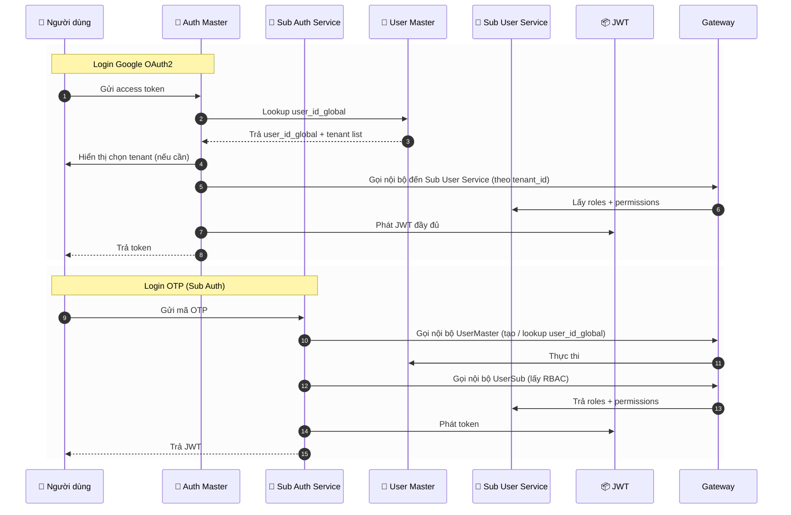

# ADR-006: Chiến lược Xác thực (Auth Strategy)

## Bối cảnh (Context)

Hệ thống dx-vas cần hỗ trợ các nhóm người dùng đa dạng:

- Nhân viên, giáo viên & học sinh (một số tenant cấp): sử dụng tài khoản Google Workspace (OAuth2)
- Phụ huynh & học sinh: sử dụng OTP hoặc tài khoản local riêng theo từng trường
- Một người dùng có thể hoạt động ở nhiều tenant (trường thành viên)

Do đó, hệ thống cần kiến trúc xác thực:

- Hỗ trợ Google OAuth2 & Local/OTP đồng thời
- Tách biệt vai trò xác thực toàn cục vs xác thực cục bộ
- Phát hành JWT chứa đầy đủ `user_id_global`, `tenant_id`, `roles`, `permissions`
- Phù hợp với kiến trúc multi-tenant phân tầng (Auth Master / Sub Auth)

## Quyết định (Decision)

### 1. Tầng xác thực (Authentication Layers)

| Thành phần | Vai trò |
|------------|---------|
| **Auth Service Master** | Xử lý đăng nhập Google OAuth2 toàn cục |
| **Sub Auth Service (per tenant)** | Xử lý đăng nhập Local/OTP nội bộ theo từng tenant |

### 2. Luồng xác thực chính

#### 🔐 Google OAuth2 (qua Auth Master)

1. Người dùng đăng nhập Google → nhận access token
2. Auth Master gọi User Service Master để:
   - Tìm hoặc tạo `user_id_global`
   - Lấy danh sách `tenant_id` user thuộc về
3. Nếu user có nhiều tenant → chọn tenant
4. Auth Master, sau khi biết `tenant_id`, sẽ gọi Sub User Service tương ứng để lấy `roles`, `permissions` của người dùng trong tenant đã chọn. Việc gọi này:
   - **Luôn đi qua API Gateway**, nhằm đảm bảo chuẩn hóa định tuyến, xác thực nội bộ, logging và audit trail.
   - Gateway sẽ định tuyến đến đúng stack của tenant tương ứng (VD: `dx-vas-tenant-abc`), theo `tenant_id` và prefix nội bộ.
   - Auth Master gắn header đặc biệt `X-Internal-Call` hoặc sử dụng service account JWT để được phép truy cập Sub User Service.
5. Phát hành JWT chứa thông tin người dùng và RBAC trong tenant đã chọn:

```json
{
  "user_id": "uuid",
  "tenant_id": "uuid",
  "roles": [...],
  "permissions": [...],
  "auth_provider": "google",
  "exp": ...,
  "trace_id": ...
}
```

> Lưu ý: Trong một số triển khai, JWT có thể chỉ chứa `roles` (danh sách role\_code), còn `permissions` sẽ được Gateway truy vấn từ Redis theo `rbac:{user_id}:{tenant_id}` để giảm kích thước token và đảm bảo điều kiện (`condition`) luôn được cập nhật chính xác.

#### 🔐 OTP/Local Login (qua Sub Auth Service)

1. Sub Auth nhận yêu cầu login OTP (SMS/email)
2. Gọi User Master để tạo hoặc lấy `user_id_global`
   - Giao tiếp này **luôn qua API Gateway**, theo chuẩn nội bộ.
   - Sub Auth Service sử dụng token đặc biệt hoặc header `X-Internal-Call` để được phép truy cập
3. Gọi Sub User Service (của tenant hiện tại) **qua Gateway** để lấy RBAC
4. Phát hành JWT giống Auth Master:

   * Sử dụng cùng chuẩn JWT (thuật toán ký, claim format)
   * Có thể dùng key ký riêng per tenant, nhưng phải được Gateway biết để xác minh

### 3. JWT và RBAC

* JWT được ký và xác minh bởi API Gateway
* JWT luôn chứa:

  * `user_id`
  * `tenant_id`
  * `roles` (tối thiểu)
* `permissions` có thể:

  * Embed trực tiếp trong JWT (nếu đơn giản và ngắn)
  * Hoặc được tra cứu tại API Gateway từ Redis cache theo key:
    `rbac:{user_id}:{tenant_id}`
    ⇒ giúp RBAC condition luôn cập nhật theo thời gian thực và dễ invalidate

### 4. Rotation & Bảo mật

* JWT ký bằng key riêng theo môi trường (`dev`, `staging`, `prod`)
* Luân phiên key định kỳ (manual hoặc automatic rotation)
* Kiểm soát TTL & revocation thông qua trace ID + Pub/Sub event

## Hệ quả (Consequences)

✅ Ưu điểm:

* Phân tách rõ vai trò xác thực toàn cục vs cục bộ
* Dễ mở rộng khi có thêm tenant mới
* Có thể deploy Sub Auth Service riêng nếu trường cần xác thực tùy biến

⚠️ Lưu ý:

* Cần handle trường hợp người dùng thuộc nhiều tenant (buộc chọn tenant)
* Mỗi Sub Auth Service cần được kiểm toán kỹ về bảo mật OTP

## Sơ đồ minh họa



## Liên kết liên quan

* [`adr-007-rbac.md`](./adr-007-rbac.md) – Chiến lược RBAC phân tầng
* [`rbac-deep-dive.md`](../architecture/rbac-deep-dive.md)
* [`README.md#3-auth-service`](../README.md#3-auth-service)
