## TÀI LIỆU KIẾN TRÚC CHI TIẾT – HỆ THỐNG CHUYỂN ĐỔI SỐ VAS

### 0. Yêu cầu dự án

* **Mục tiêu chính:** Triển khai một hệ thống chuyển đổi số toàn diện cho Trường Việt Anh, tích hợp quản lý học sinh, giáo viên, phụ huynh, lớp học, học phí, thông báo, học tập online và quy trình tuyển sinh.
* **Quy mô thiết kế ban đầu:**

  * 80 nhân viên, giáo viên
  * 500 học sinh
  * Tối đa 500 phụ huynh (1 phụ huynh/học sinh)
* **Khả năng mở rộng tối đa:**

  * 200 nhân viên, giáo viên
  * 1200 học sinh
  * 1200 phụ huynh
* **Phân quyền người dùng:**

  * Nhân viên, giáo viên, học sinh sử dụng tài khoản Google Workspace Education Essentials → Đăng nhập qua Google OAuth2
  * Phụ huynh không có tài khoản Workspace → Đăng nhập bằng tài khoản cục bộ hoặc OTP

### 1. Đăng nhập & Phân quyền động (RBAC)

VAS sử dụng cơ chế RBAC động được đánh giá và thực thi tại API Gateway, giúp kiểm soát chi tiết theo vai trò và ngữ cảnh truy cập của từng người dùng. Các nhóm người dùng như giáo viên, học sinh (qua Google OAuth2) và phụ huynh (qua OTP hoặc tài khoản cục bộ) đều được phân quyền rõ ràng thông qua hệ thống RBAC này.

* Triết lý thiết kế:

  * Hệ thống RBAC động, condition-based.
  * Phân tách rõ vai trò (role), hành động (action) và điều kiện (condition) theo từng người dùng.
  * API Gateway chịu trách nhiệm xác thực token, kiểm tra trạng thái hoạt động và đánh giá phân quyền trước khi chuyển tiếp request.

📘 Để tìm hiểu sâu hơn về cơ chế RBAC, vui lòng xem tài liệu chi tiết tại:👉 [Chi tiết Kiến trúc RBAC](./architecture/rbac-deep-dive.md)

### 2. Customer Portal (PWA)

* Giao diện cho phụ huynh và học sinh.
* Hỗ trợ OTP/Zalo login, cài đặt trên mobile, offline với cache gần nhất.
* Chế độ offline chỉ cho phép đọc dữ liệu đã được cache trước đó.
* Đồng bộ lại dữ liệu tự động khi có kết nối mạng.

### 3. Admin Webapp (SPA)

* Giao diện quản trị.
* Tích hợp LMS, SIS, Notification, RBAC.
* Sẽ tích hợp Condition Builder UI để quản lý granular permission một cách trực quan.

### 4. API Gateway

* Xác thực đa luồng (OAuth2 hoặc local token).
* Kiểm tra RBAC theo loại người dùng và scope.
* Forward request đến CRM, SIS, LMS, Notification.
* Header định danh cần bảo vệ bằng ký số hoặc mạng nội bộ tin cậy.
* Áp dụng rate limiting chi tiết, CAPTCHA chống brute-force.
* Đang viết ADR riêng để triển khai ký header nội bộ (`X-Signature`).

### 5. Auth Service

* Xử lý xác thực người dùng: Google OAuth2 (giáo viên, học sinh, nhân viên) và OTP/email (phụ huynh).
* Phát hành JWT và Refresh Token.
* Hỗ trợ làm mới token, đăng xuất, và truy vết thông tin đăng nhập.
* OTP có thêm CAPTCHA và giới hạn gửi để tránh spam.
* Khuyến nghị phụ huynh tạo tài khoản cục bộ với mật khẩu mạnh nếu đăng nhập thường xuyên.

### 6. User Service

* Quản lý toàn bộ người dùng trong hệ thống: định danh, trạng thái hoạt động (`is_active`), quyền truy cập (roles, permissions).
* Là trung tâm RBAC.
* Phát sự kiện `user_status_changed`, `rbac_updated` để Gateway cập nhật cache RBAC tương ứng.

### 7. CRM – SuiteCRM

* Quản lý pipeline tuyển sinh.
* Khi phụ huynh đăng ký nhập học thành công → tự chuyển sang SIS.
* Giao tiếp qua API Gateway, kiểm soát RBAC.
* Kế hoạch chuyển đổi cơ chế đồng bộ sang event-driven, dùng Pub/Sub hoặc Redis stream.

### 8. SIS – Gibbon

* Quản lý học sinh, lớp, điểm danh, học phí.
* Có export API cho LMS, Portal, Admin Webapp.
* Lưu vết lịch sử: học lực, lớp học, học bạ.
* Liên kết phụ huynh – học sinh lưu trong bảng tham chiếu.

### 9. LMS – Moodle

* Học tập online, giao bài, chấm điểm.
* SSO với OAuth2.
* Tự động đồng bộ học sinh từ SIS.
* Điểm có thể đẩy ngược về SIS.

### 10. Notification Service

* Gửi thông báo Web, Email (Gmail API), Zalo OA, Google Chat.
* Phụ huynh nhận thông báo qua Zalo/Email.
* Học sinh, giáo viên nhận qua WebPush/Google Chat.
* Người dùng chọn kênh ưa thích qua giao diện.
* Tích hợp A/B testing và tracking nếu cần.

### 11. Zalo OA & Google Chat

* Gửi thông báo học phí, sự kiện qua Zalo ZNS.
* Gửi nội bộ (giáo viên, nhân viên) qua Google Chat.
* Có xử lý lỗi API, quota, timeout.
* Dự kiến bổ sung cơ chế retry và dashboard kiểm tra trạng thái gửi.

### 12. Hạ tầng triển khai

* Cloud Run, Cloud SQL (có PITR), Redis, Cloud Storage.
* Logging & Monitoring: Thu thập log tập trung, giám sát error rate, latency.
* Triển khai distributed tracing (ví dụ: OpenTelemetry).
* Đang thiết kế kế hoạch DR (Disaster Recovery) đầy đủ với RTO/RPO theo từng service.
* 📘 Xem thêm:
  👉 [DR Playbook](./runbooks/dr-playbook.md) [Checklist xử lý sự cố](./runbooks/incident-checklist.md)

### 13. CI/CD & DevOps

* GitHub Actions / Cloud Build → Cloud Run.
* Staging + production, rollback.
* Test tự động: unit, integration, End-to-End (E2E), và contract testing (Pact).
* Đã áp dụng ADR-003 – secrets được quản lý và rotate định kỳ qua Secret Manager.
* Dự kiến triển khai Chaos Testing cho các dịch vụ quan trọng.

### 14. Bảo mật & Giám sát

* Mã hóa dữ liệu nhạy cảm.
* Chống OWASP Top 10, bao gồm CSRF, XSS, SQL Injection.
* Triển khai xác thực đa yếu tố (MFA) cho các tài khoản quản trị và nhân viên quyền cao.
* Giám sát xác thực phụ huynh (login rate, reset mật khẩu).
* Ghi log chi tiết theo người dùng, endpoint, trạng thái.

### 15. Data Migration Plan

* Nếu có hệ thống cũ, dữ liệu sẽ được di chuyển theo lộ trình Blueprint rõ ràng:

  * Mapping bảng dữ liệu
  * Kiểm tra chất lượng dữ liệu (data quality)
  * Kiểm thử trước và sau khi migrate
  * Rollback plan nếu phát hiện lỗi
  * Hỗ trợ chế độ song song (parallel run)

### 16. Đào tạo & Chuyển giao

* Mỗi nhóm người dùng sẽ có gói đào tạo riêng (nhân viên, giáo viên, học sinh, phụ huynh).
* Tài liệu bao gồm:

  * Video ngắn
  * Handout dạng PDF
  * Demo trực tiếp (live/recorded)

### 17. Tổng kết

Hệ thống chuyển đổi số VAS được thiết kế mở rộng linh hoạt đến 2600 người dùng, hỗ trợ xác thực phân tách giữa người dùng có Workspace (OAuth2) và phụ huynh (Local/OTP), đảm bảo bảo mật, giám sát, phục hồi thảm họa, đào tạo và khả năng phát triển dài hạn.

Toàn bộ các phản hồi chiến lược từ anh Bill đã được đưa vào kế hoạch hành động và roadmap triển khai – đặc biệt các khía cạnh RBAC UI, Data Sync, OTP Security, Offline PWA, DR Planning và Data Migration đã được chuẩn bị cụ thể và ghi nhận trong README.md này như một tài liệu trung tâm sống của dự án.

---

## Phụ lục A – Danh sách Quyết định Kiến trúc (ADRs)

Dự án dx-vas sử dụng các Quyết định Kiến trúc (Architecture Decision Records - ADRs) để ghi lại những lựa chọn thiết kế quan trọng về mặt kiến trúc, bao gồm lý do, bối cảnh và các phương án đã được cân nhắc.

📘 Để xem danh sách đầy đủ và chi tiết các ADRs đã được phê duyệt, vui lòng truy cập: 👉 [Danh sách ADRs của dự án](./ADR/index.md)

---

## Phụ lục B – Nguyên tắc Kiến trúc Cốt lõi

* **UX-first:** Ưu tiên trải nghiệm người dùng (đặc biệt phụ huynh không rành công nghệ)
* **Modular-first:** Thiết kế hệ thống dạng microservice – dễ thay thế, triển khai riêng rẽ
* **Security-by-Design:** Tích hợp bảo mật từ đầu vào thiết kế
* **Data Consistency > Availability:** Trong môi trường giáo dục, dữ liệu đúng quan trọng hơn phản hồi nhanh
* **Infra-as-Code:** Hạ tầng và CI/CD đều được mô hình hóa, kiểm soát bằng mã nguồn

---

## Phụ lục C – Sơ đồ Kiến trúc

📁 Các sơ đồ kiến trúc hệ thống được lưu trữ và cập nhật chi tiết tại: 👉 [System Diagrams](./architecture/system-diagrams.md)

Tài liệu này bao gồm:
- Sơ đồ tổng quan hệ thống
- Các luồng nghiệp vụ chính (tuyển sinh, thông báo, phân quyền...)
- Sơ đồ vòng đời tài khoản
- Sơ đồ triển khai hạ tầng trên Google Cloud
- Chú giải và hướng dẫn đọc sơ đồ

Dưới đây là sơ đồ cấu trúc tổng thể để quản lý toàn bộ tài liệu kiến trúc hệ thống **dx-vas**, được tổ chức theo các tầng logic: Tổng quan hệ thống → Tài liệu kiến trúc → Hướng dẫn phát triển/vận hành → Thiết kế chi tiết theo service → Interface Contracts → ADRs.

```mermaid
graph TD
  A[README.md<br/>Tổng quan kiến trúc dự án] --> B[🏛️ docs/architecture/<br/>Tài liệu kiến trúc hệ thống]
  A --> C[📁 docs/interfaces/<br/>Interface Contracts - OpenAPI]
  A --> D[📚 docs/dev/<br/>Cẩm nang phát triển & vận hành]
  A --> E[🧱 docs/services/<br/>Thiết kế chi tiết từng service]
  A --> F[📜 docs/ADR/index.md<br/>Chỉ mục ADRs]

  B --> B1[📊 system-diagrams.md<br/>Sơ đồ tổng quan & luồng]
  B --> B2[🔐 rbac-deep-dive.md<br/>RBAC động chi tiết]
  B --> B3[... kiến trúc khác nếu có]

  C --> C1[📑 ic-09-user-service.md<br/>IC cho User Service]
  C --> C2[Các IC cho các service khác...]
  C --> C3[🧭 adr-index.md<br/>Mapping IC ↔ ADR]

  D --> D1[🧑‍💻 dev-guide.md]
  D --> D2[🧪 backend-dev-guide.md]
  D --> D3[⚙️ ops-guide.md]
  D --> D4[🧑‍💻 frontend-dev-guide.md]

  E --> E1[📌 user-service/]
  E --> E2[📌 auth-service/]
  E --> E3[📌 notification-service/]
  E1 --> E1a[📄 design.md]
  E1 --> E1b[🗃️ data-model.md]

  F --> F1[adr-001-ci-cd.md]
  F --> F2[adr-003-secrets.md]
  F --> F3[adr-006-auth-strategy.md]
  F --> F4[... đến adr-024]

  style A fill:#f9f,stroke:#333,stroke-width:2px
  style B,C,D,E,F fill:#ffe,stroke:#666
  style B1,B2,B3,C1,C2,C3,D1,D2,D3,D4,E1,E2,E3,E1a,E1b,F1,F2,F3,F4 fill:#fff,stroke:#ccc

```

📌 **Ý nghĩa cấu trúc:**

* **`README.md`** là trung tâm, giúp người mới có thể hiểu toàn bộ kiến trúc trong vài phút.
* **`system-diagrams.md`** và **`rbac-deep-dive.md`** là 2 nhánh kiến trúc chuyên sâu (tổng thể & RBAC).
* **`docs/dev/`** là bộ hướng dẫn vận hành & phát triển cho toàn đội.
* **`docs/services/`** chứa thiết kế chi tiết của từng service theo cấu trúc chuẩn (SDD, Data Model).
* **`interface-contracts/`** chứa định nghĩa OpenAPI YAML cho từng service.
* **`adr-index.md`** và các ADRs lưu lại toàn bộ quyết định kiến trúc quan trọng theo thời gian.

---

## Phụ lục D – Interface Contracts (ICs)

Tất cả các dịch vụ trong hệ thống dx-vas đều có tài liệu định nghĩa giao tiếp (Interface Contracts), sử dụng định dạng Markdown mô tả OpenAPI hoặc UI behavior.

📁 Các tài liệu IC được lưu trữ tại thư mục: [`interfaces`](./interfaces/)

| Dịch vụ | Mô tả | File IC |
|--------|-------|---------|
| API Gateway | Cổng vào trung tâm của hệ thống, xử lý xác thực và kiểm tra RBAC | [`ic-01-api-gateway.md`](./interfaces/ic-01-api-gateway.md) |
| Admin Webapp | Ứng dụng quản trị nội bộ cho nhân viên và giáo viên | [`ic-02-admin-webapp.md`](./interfaces/ic-02-admin-webapp.md) |
| Customer Portal | PWA dành cho phụ huynh và học sinh | [`ic-03-customer-portal.md`](./interfaces/ic-03-customer-portal.md) |
| Notification Service | Dịch vụ gửi thông báo đa kênh (Web, Email, Zalo, Chat) | [`ic-04-notification.md`](./interfaces/ic-04-notification.md) |
| CRM Adapter | Giao tiếp với SuiteCRM trong quá trình tuyển sinh | [`ic-05-crm.md`](./interfaces/ic-05-crm.md) |
| SIS Adapter | Giao tiếp với hệ thống Gibbon SIS | [`ic-06-sis.md`](./interfaces/ic-06-sis.md) |
| LMS Adapter | Giao tiếp với hệ thống Moodle LMS | [`ic-07-lms.md`](./interfaces/ic-07-lms.md) |
| Auth Service | Dịch vụ xác thực và phát hành token (OAuth2, OTP) | [`ic-08-auth-service.md`](./interfaces/ic-08-auth-service.md) |
| User Service | Quản lý người dùng, phân quyền động RBAC, trạng thái hoạt động | [`ic-09-user-service.md`](./interfaces/ic-09-user-service.md) |

📌 Mỗi IC có thể bao gồm:
- Mô tả các API endpoint hoặc UI behavior chính
- Các schema (request/response)
- Quy tắc RBAC áp dụng nếu có
- Link tham chiếu đến các ADR hoặc schema dùng chung

---

## Phụ lục E – Hướng dẫn đóng góp & phát triển

* Quy trình pull request & review code tại: `CONTRIBUTING.md`
* Coding style: theo PEP8 + Black (Python), ESLint (JS)
* Test coverage yêu cầu: ≥ 85% unit, ≥ 70% integration
* Luồng CI/CD:

  1. Push code → CI chạy lint/test/scan
  2. Merge vào `dev` → Deploy Staging
  3. Merge vào `main` → Require approval → Deploy Production
