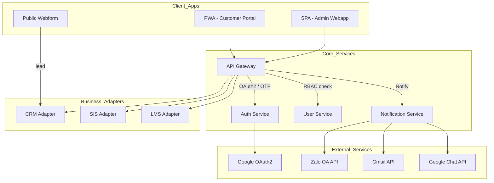
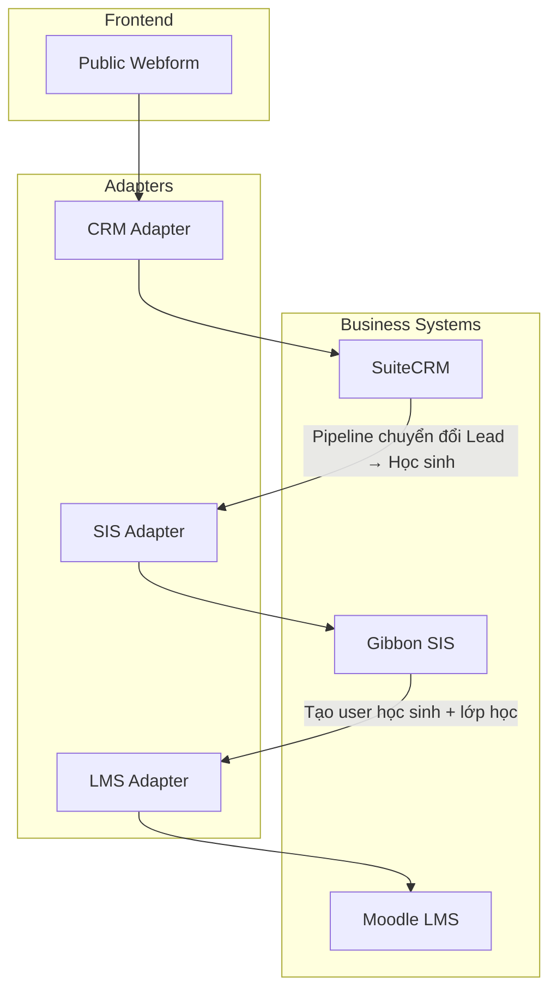

# Sơ đồ Kiến trúc Hệ thống dx\_vas

Tài liệu này tập hợp tất cả các sơ đồ kiến trúc quan trọng của hệ thống chuyển đổi số dx\_vas, bao gồm:

* Sơ đồ kiến trúc tổng thể
* Diễn giải các khối chức năng
* Các sơ đồ con chi tiết theo từng luồng nghiệp vụ (ví dụ: Tuyển sinh, Thông báo, Phân quyền RBAC...)

---

## 1. Sơ đồ tổng quan hệ thống

---

### Diễn giải sơ đồ tổng quan

#### 1. 🖥️ Client Applications (Giao diện người dùng)

- **Public Webform**: Cổng thu lead tuyển sinh.
- **Customer Portal (PWA)**: Giao diện dành cho phụ huynh & học sinh – OTP login, xem điểm, lịch học, thông báo...
- **Admin Webapp (SPA)**: Giao diện dành cho nhân viên, giáo viên – quản lý học sinh, lớp, RBAC, thông báo...

> Hai ứng dụng này (Admin Webapp, Customer Portal) thay thế hoàn toàn việc truy cập trực tiếp vào UI của SuiteCRM, Gibbon, Moodle.

#### 2. 🧠 Core Services

* **API Gateway**: Điểm kiểm soát chính, thực hiện xác thực, RBAC và định tuyến request.
* **Auth Service**: Xác thực Google OAuth2 và OTP.
* **User Service**: Quản lý thông tin người dùng, phân quyền.
* **Notification**: Gửi thông báo đa kênh.

#### 3. 🔌 Business Adapters

* Các lớp tích hợp với hệ thống CRM, SIS, LMS qua API.

#### 4. 🌐 External Services

* Các dịch vụ ngoài như Google OAuth2, Gmail API, Zalo OA, Google Chat API.

---

## 2. Admission Flow – Luồng Tuyển sinh

---

**Diễn giải Admission Flow:**

1. **Phụ huynh điền thông tin tại Public Webform** → tạo một bản ghi lead trong CRM Adapter.
2. **CRM Adapter** chuyển dữ liệu này sang **SuiteCRM**, nơi quản lý pipeline tuyển sinh (ví dụ: liên hệ, thử lớp, đóng phí...).
3. Khi lead đủ điều kiện nhập học:
   - CRM gửi thông tin sang **SIS Adapter** để tạo học sinh trong **Gibbon SIS**.
4. SIS xử lý:
   - Tạo hồ sơ học sinh, gán lớp, mã số định danh nội bộ.
   - Đẩy thông tin sang **LMS Adapter** để khởi tạo tài khoản Moodle.
5. Học sinh được khởi tạo trong **Moodle LMS** với liên kết SIS-ID, được phân lớp và kích hoạt lộ trình học trực tuyến.

📌 Toàn bộ quá trình này đi qua API Gateway và các adapter, không tương tác trực tiếp với cơ sở dữ liệu nội bộ của SuiteCRM, Gibbon, Moodle.
