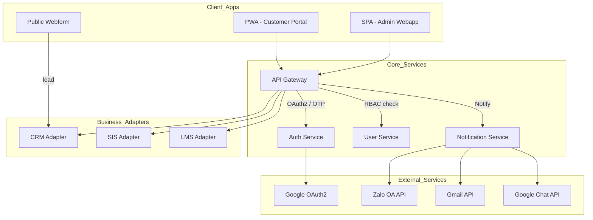
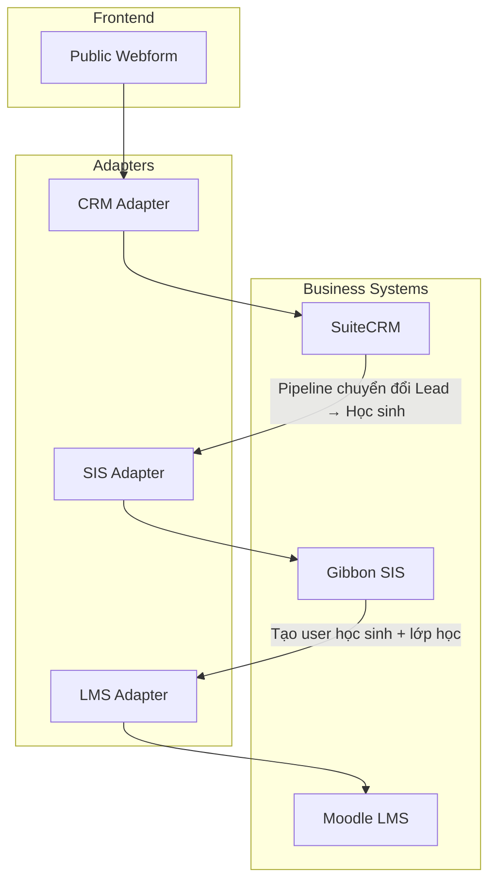
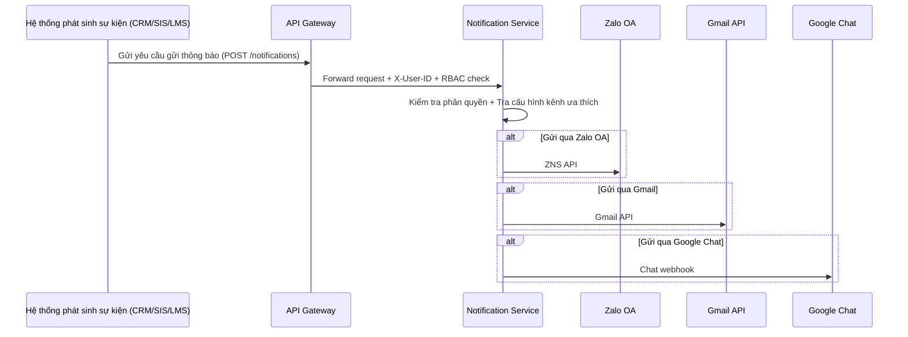
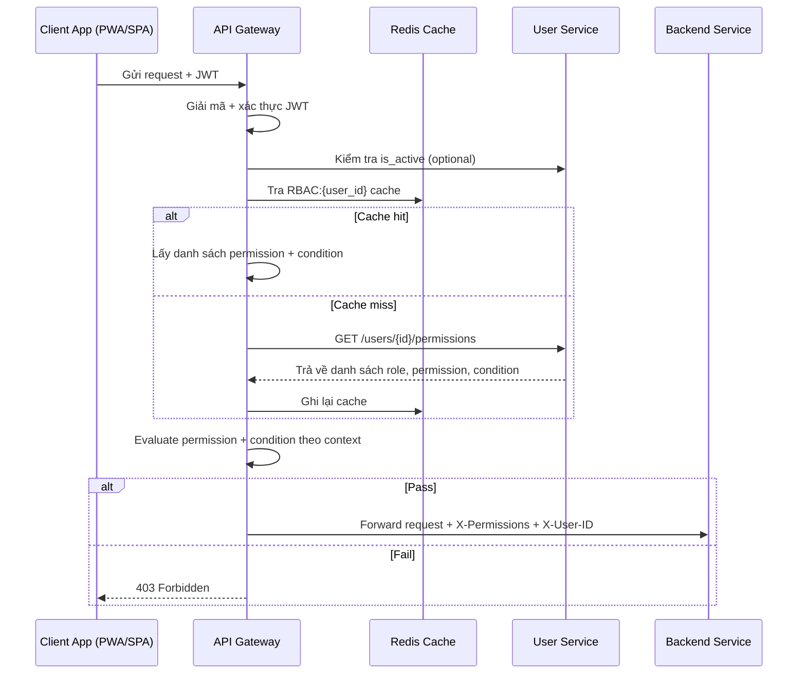
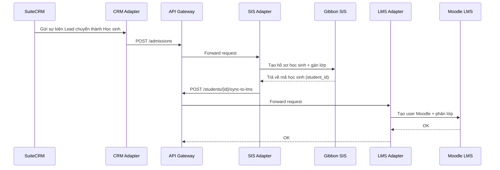

# Sơ đồ Kiến trúc Hệ thống dx\_vas

Tài liệu này tập hợp tất cả các sơ đồ kiến trúc quan trọng của hệ thống chuyển đổi số dx\_vas, bao gồm:

* Sơ đồ kiến trúc tổng thể
* Diễn giải các khối chức năng
* Các sơ đồ con chi tiết theo từng luồng nghiệp vụ (ví dụ: Tuyển sinh, Thông báo, Phân quyền RBAC...)

---

## 1. Sơ đồ tổng quan hệ thống

**Diễn giải sơ đồ tổng quan**

1. 🖥️ Client Applications (Giao diện người dùng)
  - **Public Webform**: Cổng thu lead tuyển sinh.
  - **Customer Portal (PWA)**: Giao diện dành cho phụ huynh & học sinh – OTP login, xem điểm, lịch học, thông báo...
  - **Admin Webapp (SPA)**: Giao diện dành cho nhân viên, giáo viên – quản lý học sinh, lớp, RBAC, thông báo...
> Hai ứng dụng này (Admin Webapp, Customer Portal) thay thế hoàn toàn việc truy cập trực tiếp vào UI của SuiteCRM, Gibbon, Moodle.
2. 🧠 Core Services
  * **API Gateway**: Điểm kiểm soát chính, thực hiện xác thực, RBAC và định tuyến request.
  * **Auth Service**: Xác thực Google OAuth2 và OTP.
  * **User Service**: Quản lý thông tin người dùng, phân quyền.
  * **Notification Service**: Gửi thông báo đa kênh.
3. 🔌 Business Adapters
  * Các lớp tích hợp với hệ thống CRM, SIS, LMS qua API.
4. 🌐 External Services
  * Các dịch vụ ngoài như Google OAuth2, Gmail API, Zalo OA, Google Chat API.

---

## 2. Admission Flow – Luồng Tuyển sinh

**Diễn giải Admission Flow:**

1. **Phụ huynh điền thông tin tại Public Webform** → **CRM Adapter** tiếp nhận dữ liệu.
2. **CRM Adapter** chuyển tiếp qua API Gateway để tạo bản ghi lead trong **SuiteCRM**, nơi quản lý pipeline tuyển sinh (ví dụ: liên hệ, thử lớp, đóng phí...).
3. Khi lead đủ điều kiện nhập học:
   - CRM gửi thông tin sang **SIS Adapter** để tạo học sinh trong **Gibbon SIS**.
4. SIS xử lý:
   - Tạo hồ sơ học sinh, gán lớp, mã số định danh nội bộ.
   - Đẩy thông tin sang **LMS Adapter** để khởi tạo tài khoản Moodle.
5. Học sinh được khởi tạo trong **Moodle LMS** với liên kết SIS-ID, được phân lớp và kích hoạt lộ trình học trực tuyến.

📌 Toàn bộ quá trình này đi qua API Gateway và các adapter, không tương tác trực tiếp với cơ sở dữ liệu nội bộ của SuiteCRM, Gibbon, Moodle.

---

## 3. Notification Flow – Luồng Gửi Thông báo

**Diễn giải Notification Flow:**

1. **Một service nghiệp vụ (CRM, SIS, LMS...) phát sinh sự kiện** – ví dụ:
   - CRM: phụ huynh đăng ký thành công
   - SIS: học sinh điểm danh trễ
   - LMS: bài tập đến hạn
2. Service gọi `POST /notifications` qua API Gateway, đính kèm JWT hoặc service token.
3. **API Gateway thực hiện kiểm tra phân quyền** (nếu là người dùng cuối), rồi forward tới Notification Service.
4. **Notification Service** kiểm tra:
   - User có quyền nhận loại thông báo này không?
   - Kênh ưa thích là gì? (Zalo / Gmail / Google Chat / WebPush...)
5. Thông báo được gửi đi qua các API tương ứng, với retry và xử lý lỗi nếu cần.

📌 Notification Service hỗ trợ gửi đồng thời nhiều kênh và có thể log lại từng trạng thái gửi, cho phép tracking và alert nếu gửi thất bại.

---

## 4. RBAC Evaluation Flow – Luồng Đánh giá Phân quyền Động

**Diễn giải RBAC Evaluation Flow:**

1. **Client App (PWA/SPA)** gửi request REST đến API Gateway, kèm theo JWT (Bearer token).
2. **API Gateway**:
   - Giải mã và xác thực token (kiểm tra chữ ký, thời hạn).
   - Kiểm tra trạng thái `is_active` của user từ User Service (nếu cần).
   - Tra Redis: key `RBAC:{user_id}` để lấy danh sách permissions.
3. Nếu Redis cache **hit**:
   - Gateway lấy danh sách `permission` kèm `condition` JSONB.
4. Nếu cache **miss**:
   - Gateway gọi `GET /users/{id}/permissions` từ User Service.
   - Ghi dữ liệu RBAC mới vào Redis với TTL.
5. **Evaluate**:
   - Gateway so sánh từng permission + condition với context từ request.
   - Nếu có ít nhất một permission thỏa: cho phép request.
6. **Kết quả**:
   - Nếu pass: forward đến Backend Service, kèm các header:
     - `X-Permissions`: danh sách mã quyền (đã pass)
     - `X-User-ID`, `X-Role`, `Trace-ID`...
   - Nếu fail: trả về `403 Forbidden`.

📌 RBAC được đánh giá hoàn toàn tại Gateway, backend không cần decode JWT hay tái kiểm tra quyền.

---

## 5. Data Synchronization Flow – Đồng bộ học sinh CRM → SIS → LMS

**Diễn giải Data Synchronization Flow (CRM → SIS → LMS):**

1. **Trong SuiteCRM**, khi một `Lead` được đánh dấu là “đã trúng tuyển”, CRM sẽ phát sinh sự kiện chuyển đổi.
2. **CRM Adapter** tiếp nhận sự kiện và gửi `POST /admissions` qua API Gateway.
3. **API Gateway** forward đến **SIS Adapter**, nơi thực hiện:
   - Tạo học sinh mới trong **Gibbon SIS**
   - Gán vào lớp, campus tương ứng
4. SIS trả về `student_id`, được lưu tại Adapter.
5. SIS Adapter gọi tiếp `POST /students/{id}/sync-to-lms` qua Gateway → forward đến **LMS Adapter**.
6. **LMS Adapter** tạo tài khoản Moodle cho học sinh và phân lớp tương ứng.
7. Sau khi tạo thành công, phản hồi xác nhận được gửi ngược về.

📌 Mọi hành động đều đi qua API Gateway và được kiểm soát phân quyền nếu có liên quan đến user. Quá trình sync có thể được lặp lại định kỳ hoặc phát động theo event.

---
