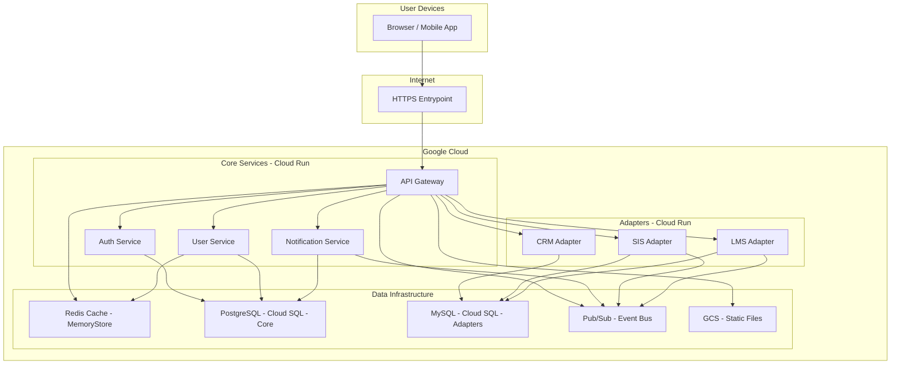

# Sơ đồ Kiến trúc Hệ thống dx-vas

Tài liệu này tập hợp tất cả các sơ đồ kiến trúc quan trọng của hệ thống chuyển đổi số dx-vas, bao gồm:

* Sơ đồ kiến trúc tổng thể
* Diễn giải các khối chức năng
* Các sơ đồ con chi tiết theo từng luồng nghiệp vụ (ví dụ: Tuyển sinh, Thông báo, Phân quyền RBAC...)

## 📚 Mục lục

1. [Sơ đồ tổng quan hệ thống](#1-sơ-đồ-tổng-quan-hệ-thống)
2. [Admission Flow – Luồng Tuyển sinh](#2-admission-flow--luồng-tuyển-sinh)
3. [Notification Flow – Luồng Gửi Thông báo](#3-notification-flow--luồng-gửi-thông-báo)
4. [RBAC Evaluation Flow – Luồng Đánh giá Phân quyền Động](#4-rbac-evaluation-flow--luồng-đánh-giá-phân-quyền-động)
5. [Data Synchronization Flow – Đồng bộ học sinh CRM → SIS → LMS](#5-data-synchronization-flow--đồng-bộ-học-sinh-crm--sis--lms)
6. [Service-to-Service Auth Flow – Giao tiếp giữa các dịch vụ nội bộ](#6-service-to-service-auth-flow--giao-tiếp-giữa-các-dịch-vụ-nội-bộ)
7. [User Account Lifecycle Flow – Vòng đời tài khoản người dùng](#7-user-account-lifecycle-flow--vòng-đời-tài-khoản-người-dùng)
8. [Chú giải sơ đồ (Legend) - Hướng dẫn đọc](#8-chú-giải-sơ-đồ-legend---hướng-dẫn-đọc)
9. [Deployment Overview Diagram – Sơ đồ triển khai tổng quan](#9-deployment-overview-diagram--sơ-đồ-triển-khai-tổng-quan)

---

## 1. Sơ đồ tổng quan hệ thống

**Diễn giải sơ đồ tổng quan**

1. 🖥️ Client Applications (Giao diện người dùng)
  - **Public Webform**: Cổng thu lead tuyển sinh.
  - **Customer Portal (PWA)**: Giao diện dành cho phụ huynh & học sinh – OTP login, xem điểm, lịch học, thông báo...
  - **Admin Webapp (SPA)**: Giao diện dành cho nhân viên, giáo viên – quản lý học sinh, lớp, RBAC, thông báo...
> Hai ứng dụng này (Admin Webapp, Customer Portal) thay thế hoàn toàn việc truy cập trực tiếp vào UI của SuiteCRM, Gibbon, Moodle.
2. 🧠 Core Services
  * **API Gateway**: Điểm kiểm soát chính, thực hiện xác thực, RBAC và định tuyến request.
  * **Auth Service**: Xác thực Google OAuth2 và OTP.
  * **User Service**: Quản lý thông tin người dùng, phân quyền.
  * **Notification Service**: Gửi thông báo đa kênh.
3. 🔌 Business Adapters
  * Các lớp tích hợp với hệ thống CRM, SIS, LMS qua API.
4. 🌐 External Services
  * Các dịch vụ ngoài như Google OAuth2, Gmail API, Zalo OA, Google Chat API.

---

## 2. Admission Flow – Luồng Tuyển sinh

**Diễn giải Admission Flow:**

1. **Phụ huynh điền thông tin tại Public Webform** → **CRM Adapter** tiếp nhận dữ liệu.
2. **CRM Adapter** chuyển tiếp qua API Gateway để tạo bản ghi lead trong **SuiteCRM**, nơi quản lý pipeline tuyển sinh (ví dụ: liên hệ, thử lớp, đóng phí...).
3. Khi lead đủ điều kiện nhập học:
   - CRM gửi thông tin sang **SIS Adapter** để tạo học sinh trong **Gibbon SIS**.
4. SIS xử lý:
   - Tạo hồ sơ học sinh, gán lớp, mã số định danh nội bộ.
   - Đẩy thông tin sang **LMS Adapter** để khởi tạo tài khoản Moodle.
5. Học sinh được khởi tạo trong **Moodle LMS** với liên kết SIS-ID, được phân lớp và kích hoạt lộ trình học trực tuyến.

📌 Toàn bộ quá trình này đi qua API Gateway và các adapter, không tương tác trực tiếp với cơ sở dữ liệu nội bộ của SuiteCRM, Gibbon, Moodle.

---

## 3. Notification Flow – Luồng Gửi Thông báo

```mermaid
sequenceDiagram
  participant Service as Hệ thống phát sinh sự kiện (CRM/SIS/LMS)
  participant Gateway as API Gateway
  participant Noti as Notification Service
  participant Zalo as Zalo OA
  participant Gmail as Gmail API
  participant Chat as Google Chat

  Service->>Gateway: Gửi yêu cầu gửi thông báo (POST /notifications)
  Gateway->>Noti: Forward request + X-User-ID + RBAC check

  Noti->>Noti: Kiểm tra phân quyền + Tra cấu hình kênh ưa thích
  alt Gửi qua Zalo OA
    Noti->>Zalo: ZNS API
  end
  alt Gửi qua Gmail
    Noti->>Gmail: Gmail API
  end
  alt Gửi qua Google Chat
    Noti->>Chat: Chat webhook
  end

```

**Diễn giải Notification Flow:**

1. **Một service nghiệp vụ (CRM, SIS, LMS...) phát sinh sự kiện** – ví dụ:
   - CRM: phụ huynh đăng ký thành công
   - SIS: học sinh điểm danh trễ
   - LMS: bài tập đến hạn
2. Service gọi `POST /notifications` qua API Gateway, đính kèm JWT hoặc service token.
3. **API Gateway thực hiện kiểm tra phân quyền** (nếu là người dùng cuối), rồi forward tới Notification Service.
4. **Notification Service** kiểm tra:
   - User có quyền nhận loại thông báo này không?
   - Kênh ưa thích là gì? (Zalo / Gmail / Google Chat / WebPush...)
5. Thông báo được gửi đi qua các API tương ứng, với retry và xử lý lỗi nếu cần.

📌 Notification Service hỗ trợ gửi đồng thời nhiều kênh và có thể log lại từng trạng thái gửi, cho phép tracking và alert nếu gửi thất bại.

---

## 4. RBAC Evaluation Flow – Luồng Đánh giá Phân quyền Động

```mermaid
sequenceDiagram
  participant Client as Client App (PWA/SPA)
  participant Gateway as API Gateway
  participant Redis as Redis Cache
  participant UserSvc as User Service
  participant Backend as Backend Service

  Client->>Gateway: Gửi request + JWT
  Gateway->>Gateway: Giải mã + xác thực JWT
  Gateway->>UserSvc: Kiểm tra is_active (optional)
  Gateway->>Redis: Tra RBAC:{user_id} cache
  alt Cache hit
    Gateway->>Gateway: Lấy danh sách permission + condition
  else Cache miss
    Gateway->>UserSvc: GET /users/{id}/permissions
    UserSvc-->>Gateway: Trả về danh sách role, permission, condition
    Gateway->>Redis: Ghi lại cache
  end

  Gateway->>Gateway: Evaluate permission + condition theo context
  alt Pass
    Gateway->>Backend: Forward request + X-Permissions + X-User-ID
  else Fail
    Gateway-->>Client: 403 Forbidden
  end
```

**Diễn giải RBAC Evaluation Flow:**

1. **Client App (PWA/SPA)** gửi request REST đến API Gateway, kèm theo JWT (Bearer token).
2. **API Gateway**:
   - Giải mã và xác thực token (kiểm tra chữ ký, thời hạn).
   - Kiểm tra trạng thái `is_active` của user từ User Service (nếu cần).
   - Tra Redis: key `RBAC:{user_id}` để lấy danh sách permissions.
3. Nếu Redis cache **hit**:
   - Gateway lấy danh sách `permission` kèm `condition` JSONB.
4. Nếu cache **miss**:
   - Gateway gọi `GET /users/{id}/permissions` từ User Service.
   - Ghi dữ liệu RBAC mới vào Redis với TTL.
5. **Evaluate**:
   - Gateway so sánh từng permission + condition với context từ request.
   - Nếu có ít nhất một permission thỏa: cho phép request.
6. **Kết quả**:
   - Nếu pass: forward đến Backend Service, kèm các header:
     - `X-Permissions`: danh sách mã quyền (đã pass)
     - `X-User-ID`, `X-Role`, `Trace-ID`...
   - Nếu fail: trả về `403 Forbidden`.

📌 RBAC được đánh giá hoàn toàn tại Gateway, backend không cần decode JWT hay tái kiểm tra quyền.

📎 Tham khảo chi tiết logic phân quyền động tại: [RBAC Deep Dive](./rbac-deep-dive.md)

---

## 5. Data Synchronization Flow – Đồng bộ học sinh CRM → SIS → LMS

```mermaid
sequenceDiagram
  participant CRM as SuiteCRM
  participant CRMA as CRM Adapter
  participant Gateway as API Gateway
  participant SISA as SIS Adapter
  participant SIS as Gibbon SIS
  participant LMSA as LMS Adapter
  participant LMS as Moodle LMS

  CRM->>CRMA: Gửi sự kiện Lead chuyển thành Học sinh
  CRMA->>Gateway: POST /admissions
  Gateway->>SISA: Forward request

  SISA->>SIS: Tạo hồ sơ học sinh + gán lớp
  SIS-->>SISA: Trả về mã học sinh (student_id)
  SISA->>Gateway: POST /students/{id}/sync-to-lms
  Gateway->>LMSA: Forward request
  LMSA->>LMS: Tạo user Moodle + phân lớp

  LMS-->>LMSA: OK
  LMSA-->>Gateway: OK
```

**Diễn giải Data Synchronization Flow (CRM → SIS → LMS):**

1. **Trong SuiteCRM**, khi một `Lead` được đánh dấu là “đã trúng tuyển”, CRM sẽ phát sinh sự kiện chuyển đổi.
2. **CRM Adapter** tiếp nhận sự kiện và gửi `POST /admissions` qua API Gateway.
3. **API Gateway** forward đến **SIS Adapter**, nơi thực hiện:
   - Tạo học sinh mới trong **Gibbon SIS**
   - Gán vào lớp, campus tương ứng
4. SIS trả về `student_id`, được lưu tại Adapter.
5. SIS Adapter gọi tiếp `POST /students/{id}/sync-to-lms` qua Gateway → forward đến **LMS Adapter**.
6. **LMS Adapter** tạo tài khoản Moodle cho học sinh và phân lớp tương ứng.
7. Sau khi tạo thành công, phản hồi xác nhận được gửi ngược về.

📌 Mọi hành động đều đi qua API Gateway và được kiểm soát phân quyền nếu có liên quan đến user. Quá trình sync có thể được lặp lại định kỳ hoặc phát động theo event.

---

## 6. Service-to-Service Auth Flow – Giao tiếp giữa các dịch vụ nội bộ

```mermaid
sequenceDiagram
  participant ServiceA as Notification Service
  participant Gateway as API Gateway
  participant UserSvc as User Service

  ServiceA->>Gateway: POST /users/{id}/status + Internal Auth Header
  Gateway->>Gateway: Xác thực token nội bộ / mTLS
  Gateway->>UserSvc: Forward request + X-Service-Name + X-Signature
  UserSvc->>UserSvc: Kiểm tra định danh service gọi
  UserSvc-->>Gateway: Response
  Gateway-->>ServiceA: Response
```

**Diễn giải Service-to-Service Auth Flow:**

1. **Service A (ví dụ: Notification Service)** cần lấy thông tin người dùng, nên gọi `POST /users/{id}/status` qua API Gateway.
2. **Gateway xác thực danh tính Service A**:
   - Thông qua token nội bộ (Bearer token dành cho service)
   - Hoặc qua cơ chế mTLS (Mutual TLS)
3. Sau khi xác thực, Gateway forward request đến **User Service**, kèm theo:
   - `X-Service-Name`: Tên service gọi (ví dụ: `notification-service`)
   - `X-Signature`: Chữ ký HMAC hoặc JWT bảo vệ integrity
4. **User Service** kiểm tra xem:
   - Request có đến từ một service tin cậy không?
   - Header có hợp lệ và khớp cấu hình gọi nội bộ không?
5. Nếu hợp lệ: tiếp tục xử lý và trả kết quả về.
6. Nếu sai định danh/mất chữ ký: trả lỗi `403` hoặc `401`.

📌 Dù là service nội bộ, tất cả lời gọi đều phải qua API Gateway để kiểm soát, trace và log đầy đủ. Không cho phép service gọi nhau trực tiếp để tránh rò rỉ phân quyền hoặc bypass giám sát.

---

## 7. User Account Lifecycle Flow – Vòng đời tài khoản người dùng

```mermaid
flowchart LR
  Create[User được tạo\nPOST /users]
  Pending[Xác minh OTP hoặc nhận OAuth2]
  Active[is_active = true\nUser có thể đăng nhập]
  Inactive[is_active = false\nTài khoản bị vô hiệu hóa]
  Deleted[Tài khoản bị xóa - is_deleted = true]

  Create --> Pending
  Pending --> Active
  Active --> Inactive
  Inactive --> Active
  Active --> Deleted
  Inactive --> Deleted

  subgraph Events & Side Effects
    RBAC[Emit: rbac_updated]
    STATUS[Emit: user_status_changed]
    Cache[Invalidate RBAC cache]
  end

  Active --> RBAC
  Inactive --> STATUS
  Deleted --> STATUS
  RBAC --> Cache
  STATUS --> Cache
```

**Diễn giải User Account Lifecycle Flow:**

1. **Tài khoản người dùng được tạo**:
   - Qua `POST /users` (do nhân viên tạo), hoặc
   - Tự động tạo từ hệ thống CRM/SIS/LMS
2. **Trạng thái ban đầu: Pending**
   - Nếu là phụ huynh: chờ xác minh OTP
   - Nếu là GV/NV/HS: chờ xác thực qua Google OAuth2
3. Khi xác minh thành công:
   - Trạng thái chuyển sang `is_active = true`
   - Người dùng có thể đăng nhập, JWT được cấp
4. Trong quá trình vận hành:
   - Tài khoản có thể bị khóa tạm thời → `is_active = false`
   - Khi đó, mọi request bị chặn tại Gateway
5. Khi tài khoản bị xóa (logic delete):
   - Trạng thái `is_deleted = true` (nếu hỗ trợ)
   - Không thể khôi phục nếu đã xóa vĩnh viễn

---

**Sự kiện liên quan:**

- Khi trạng thái user thay đổi:
  - Gửi sự kiện `user_status_changed`
  - API Gateway hoặc các service có thể xử lý để invalidate cache, log bảo mật...
- Khi vai trò hoặc phân quyền thay đổi:
  - Gửi sự kiện `rbac_updated` → cập nhật cache RBAC của người dùng

📌 Việc kiểm soát vòng đời user giúp hệ thống đảm bảo bảo mật, tuân thủ và giám sát chặt chẽ trạng thái tài khoản.

---

## 8. Chú giải sơ đồ (Legend) - Hướng dẫn đọc

### 🧩 Ký hiệu các thành phần (dùng trong flowchart & sequenceDiagram):

| Ký hiệu / Label | Ý nghĩa |
|-----------------|---------|
| **Hình chữ nhật** | Dịch vụ lõi trong hệ thống (Core Service, Adapter) |
| **Hình chữ nhật bo góc** | Giao diện người dùng (SPA, PWA, Webform) hoặc hệ thống bên ngoài |
| **Mũi tên →** | Gọi API hoặc hành động chính theo thứ tự thời gian |
| **Mũi tên -->>** | Trả kết quả hoặc phản hồi |
| **Alt** (sequence) | Nhánh điều kiện (ví dụ: cache hit/miss, quyền pass/fail) |
| **Subgraph** | Phân nhóm logic (Frontend, Adapter, External Service...) |

> 📝 Các label như `POST /users`, `X-Permissions`, `student_id`, v.v. dùng để minh họa request cụ thể trong sơ đồ.

---

### 🧭 Cách đọc sơ đồ

1. **Flowchart** (luồng trạng thái, nghiệp vụ):  
   - Đọc từ trái qua phải hoặc trên xuống.
   - Theo dõi các node thể hiện trạng thái hoặc hành động chính.
   - Các nhóm `subgraph` giúp hiểu mối liên hệ giữa thành phần.

2. **Sequence Diagram** (chuỗi tương tác):  
   - Đọc theo chiều dọc từ trên xuống.
   - Cột là các thành phần tương tác (participants).
   - Dòng là request/response hoặc gọi API nội bộ.
   - Nhánh `alt` dùng để phân nhánh xử lý.

---

### 🔐 Lưu ý vận hành

- Tất cả các sơ đồ đều phản ánh kiến trúc chuẩn hóa có API Gateway làm trung tâm điều phối.
- Không có tương tác trực tiếp giữa các service với nhau hoặc với hệ thống kế thừa.
- Phân quyền (RBAC), xác thực (OAuth2/OTP/mTLS), cache Redis, event-driven đều được mô hình hóa trong sơ đồ.

---

### 🛠 Duy trì & cập nhật

- Sơ đồ được viết bằng mã **Mermaid** trực tiếp trong file Markdown.
- Được version control cùng source code, giúp dễ chỉnh sửa khi kiến trúc thay đổi.
- Có thể xuất thành ảnh (SVG/PNG) nếu cần đưa vào slide, wiki, hoặc tài liệu PDF.

---

## 9. Deployment Overview Diagram – Sơ đồ triển khai tổng quan

**Diễn giải sơ đồ triển khai tổng quan:**

1. **Client (Browser/Mobile App)** giao tiếp qua HTTPS → truy cập vào điểm vào duy nhất: `API Gateway`.
2. **API Gateway**, cùng tất cả các service (Auth, User, Notification, CRM/SIS/LMS Adapter), đều được triển khai dưới dạng container serverless trên **Google Cloud Run**.
3. **Các Core Services** (Auth, User, Notification) sử dụng **PostgreSQL** qua **Cloud SQL** để tận dụng khả năng xử lý JSONB, concurrency cao và các tính năng SQL nâng cao.
4. **Các Adapter (CRM, SIS, LMS)** sử dụng **MySQL**, tương thích với hệ quản trị mặc định của các hệ thống tích hợp (SuiteCRM, Gibbon, Moodle).
5. Dữ liệu RBAC và token được cache qua **Redis (MemoryStore)**.
6. Giao tiếp bất đồng bộ (event-driven) sử dụng **Pub/Sub** – các service phát/sử dụng sự kiện qua event bus này.
7. **Static file** (ảnh, logo, config...) được phục vụ qua **Google Cloud Storage (GCS)**.
8. Mọi lời gọi giữa các service đều phải qua Gateway (hoặc gọi nội bộ có kiểm soát qua Envoy/mTLS) để đảm bảo xác thực, phân quyền và khả năng theo dõi (traceability).

📌 Cấu trúc triển khai này đảm bảo:
- Khả năng mở rộng linh hoạt (Cloud Run autoscale)
- Tối ưu hiệu năng và tính năng theo từng nhóm thành phần
- Tách biệt logic rõ ràng (each service = 1 container)
- Bảo mật chặt chẽ và dễ dàng giám sát vận hành

📎 Cơ chế sử dụng hai CSDL (PostgreSQL & MySQL) được trình bày rõ tại: [README](../README.md#hạ-tầng-triển-khai)

---