# Sơ đồ Kiến trúc Hệ thống dx-vas

Tài liệu này tập hợp tất cả các sơ đồ kiến trúc quan trọng của hệ thống chuyển đổi số dx-vas, bao gồm:

* Sơ đồ kiến trúc tổng thể
* Diễn giải các khối chức năng
* Các sơ đồ con chi tiết theo từng luồng nghiệp vụ (ví dụ: Tuyển sinh, Thông báo, Phân quyền RBAC...)

## 📚 Mục lục Sơ đồ Kiến trúc Hệ thống dx-vas

| STT | Tên sơ đồ | Mô tả ngắn | Liên kết |
|-----|-----------|------------|----------|
| 1️⃣ | **Kiến trúc tổng quan hệ thống Multi-Tenant** | Tổng thể hệ thống gồm Shared Core và các Tenant Stack | [Xem sơ đồ](#1-kiến-trúc-tổng-quan-hệ-thống-multi-tenant) |
| 2️⃣ | **Luồng đánh giá RBAC tại API Gateway** | Cách Gateway đánh giá quyền động từ JWT + Redis + Sub Service | [Xem sơ đồ](#2-luồng-đánh-giá-rbac-tại-api-gateway) |
| 3️⃣ | **Luồng phát hành JWT đa-tenant** | Quá trình xác thực Google/OTP và phát token | [Xem sơ đồ](#3-luồng-phát-hành-jwt-đa-tenant) |
| 4️⃣ | **Luồng gửi Notification toàn hệ thống (Option B)** | Pub/Sub fan-out từ Master đến Sub Notification Services | [Xem sơ đồ](#4-luồng-gửi-notification-toàn-hệ-thống-option-b--pubsub-fan-out) |
| 5️⃣ | **Sơ đồ triển khai hạ tầng (Deployment Diagram)** | Tổ chức project GCP cho core/tenant/monitoring/data | [Xem sơ đồ](#5-sơ-đồ-triển-khai-hạ-tầng-deployment-diagram) |
| 6️⃣ | **Vòng đời tài khoản (Account Lifecycle)** | Từ tạo user → gán tenant → cấp quyền → vô hiệu hóa | [Xem sơ đồ](#6-vòng-đời-tài-khoản-account-lifecycle) |
| 7️⃣ | **Luồng đồng bộ RBAC từ Master → Sub** | Tự động hoặc thủ công sync role/permission template | [Xem sơ đồ](#7-luồng-đồng-bộ-rbac-từ-master--sub-user-services) |
| 8️⃣ | **Phân quyền giao diện người dùng (UI Role Mapping)** | Vai trò được ánh xạ đến các frontend: Superadmin, Admin, GV, PH | [Xem sơ đồ](#8-phân-quyền-giao-diện-người-dùng-ui-role-mapping) |

---

## 1. Kiến trúc tổng quan hệ thống Multi-Tenant

Sơ đồ dưới đây mô tả kiến trúc tổng thể của hệ thống dx-vas theo mô hình multi-tenant:

- Một công ty quản lý nhiều trường thành viên (tenant), mỗi trường có stack riêng biệt.
- Các stack tenant sử dụng chung các dịch vụ cốt lõi như API Gateway, User Service Master, Auth Master.
- Phân quyền, xác thực, thông báo và định tuyến được thực hiện theo từng `tenant_id`.

```mermaid
flowchart TD

  subgraph Tenant_A["Tenant A Stack"]
    A_PWA[PWA A]
    A_Admin[Admin SPA A]
    A_Auth[Sub Auth A]
    A_User[Sub User A]
    A_CRM[CRM Adapter A]
    A_SIS[SIS Adapter A]
    A_LMS[LMS Adapter A]
    A_Notify[Sub Notification A]
  end

  subgraph Tenant_B["Tenant B Stack"]
    B_PWA[PWA B]
    B_Admin[Admin SPA B]
    B_Auth[Sub Auth B]
    B_User[Sub User B]
    B_CRM[CRM Adapter B]
    B_SIS[SIS Adapter B]
    B_LMS[LMS Adapter B]
    B_Notify[Sub Notification B]
  end

  subgraph SharedCore["Shared Core Services"]
    Gateway[🛡️ API Gateway]
    AuthMaster[🔐 Auth Master]
    UserMaster[🧠 User Master]
    Superadmin[🧑‍💼 Superadmin Webapp]
    NotifyMaster[📣 Notification Master]
    PubSub[📨 Pub/Sub Bus]
    Redis[⚡ Redis Cache]
    LogSys[📊 Monitoring & Audit]
  end

  A_PWA --> Gateway
  A_Admin --> Gateway
  B_PWA --> Gateway
  B_Admin --> Gateway

  Gateway --> AuthMaster
  Gateway --> UserMaster
  Gateway --> Redis
  Gateway --> LogSys

  Gateway --> A_Auth
  Gateway --> A_User
  Gateway --> A_CRM
  Gateway --> A_SIS
  Gateway --> A_LMS
  Gateway --> A_Notify

  Gateway --> B_Auth
  Gateway --> B_User
  Gateway --> B_CRM
  Gateway --> B_SIS
  Gateway --> B_LMS
  Gateway --> B_Notify

  Superadmin --> UserMaster
  Superadmin --> NotifyMaster

  NotifyMaster --> PubSub
  PubSub --> A_Notify
  PubSub --> B_Notify

  AuthMaster --> UserMaster
  A_Auth --> UserMaster
  B_Auth --> UserMaster
```

📘 **Ghi chú:**

* Các khối `Tenant A`, `Tenant B` có thể mở rộng tùy theo số lượng trường.
* Sub Notification Service lắng nghe từ `Notification Master` thông qua Pub/Sub (`Option B`).
* RBAC, Auth, Notification đều hoạt động theo `tenant_id`, đảm bảo isolation.

---

## 2. Luồng đánh giá RBAC tại API Gateway

Sơ đồ dưới mô tả cách API Gateway thực hiện xác thực và đánh giá phân quyền động (RBAC) cho từng request dựa trên JWT, Redis cache, và Sub User Service.

- Gateway giải mã JWT để lấy `user_id`, `tenant_id`, `permissions`.
- Nếu có cache, sử dụng Redis để tra cứu nhanh.
- Nếu không có, gọi Sub User Service tương ứng để lấy quyền theo tenant.
- Đánh giá các điều kiện JSONB nếu có trong permission.

```mermaid
sequenceDiagram
    autonumber
    participant Frontend as 🌐 Frontend App
    participant Gateway as 🛡️ API Gateway
    participant JWT as 📦 JWT Token
    participant Redis as ⚡ Redis (RBAC Cache)
    participant SubUser as 🧩 Sub User Service (per tenant)

    Frontend->>Gateway: Gửi request kèm JWT

    Gateway->>JWT: Giải mã token
    Gateway->>JWT: Trích xuất user_id, tenant_id

    alt Cache Hit
        Gateway->>Redis: GET rbac:{user_id}:{tenant_id}
        Redis-->>Gateway: Trả về roles & permissions
    else Cache Miss
        Gateway->>SubUser: GET /rbac/{user_id}
        SubUser-->>Gateway: Trả về roles & permissions
        Gateway->>Redis: SET rbac:{user_id}:{tenant_id}
    end

    Gateway->>Gateway: Đánh giá permission match + condition JSONB

    alt Có quyền truy cập hợp lệ
        Gateway-->>Frontend: ✅ 200 OK (Forward đến backend)
    else Không hợp lệ
        Gateway-->>Frontend: ❌ 403 Forbidden
    end
```

📘 **Tham khảo thêm:**

* [Chi tiết về RBAC Cache](../rbac-deep-dive.md#6-chiến-lược-cache-rbac-tại-api-gateway)
* [Cấu trúc permission có điều kiện](../rbac-deep-dive.md#5-permission-có-điều-kiện-condition-jsonb)

---

## 3. Luồng phát hành JWT đa-tenant

Sơ đồ này mô tả hai luồng xác thực và phát hành JWT:

1. Qua Google OAuth2 – xử lý bởi Auth Service Master
2. Qua Local/OTP – xử lý bởi Sub Auth Service của từng tenant

Sau khi xác thực, JWT được phát hành với thông tin `user_id_global`, `tenant_id`, `roles`, `permissions` – phục vụ phân quyền tại API Gateway.

```mermaid
sequenceDiagram
    autonumber
    participant User as 👤 Người dùng
    participant Frontend as 🌐 Frontend App
    participant AuthM as 🔐 Auth Master
    participant AuthT as 🔐 Sub Auth Service
    participant Master as 🧠 User Service Master
    participant SubUser as 🧩 Sub User Service
    participant JWT as 📦 JWT Token

    rect rgba(220,220,220,0.1)
    Note over User, AuthM: Đăng nhập bằng Google OAuth2
    User->>Frontend: Truy cập ứng dụng
    Frontend->>AuthM: Gửi yêu cầu đăng nhập Google
    AuthM->>Google: OAuth2 login
    Google-->>AuthM: Access Token
    AuthM->>Master: Xác minh user Google + lấy user_id_global
    Master-->>AuthM: Trả user_id_global + danh sách tenant

    alt User có nhiều tenant
        AuthM->>Frontend: Hiển thị danh sách tenant để chọn
        Frontend->>AuthM: Gửi lại tenant đã chọn
    end

    AuthM->>SubUser: Lấy roles & permissions theo tenant đã chọn
    SubUser-->>AuthM: Trả RBAC
    AuthM->>JWT: Phát hành token chứa user_id, tenant_id, roles, permissions
    AuthM-->>Frontend: Trả JWT
    end

    rect rgba(220,220,220,0.1)
    Note over User, AuthT: Đăng nhập bằng OTP / Local
    User->>Frontend: Truy cập app tenant (VD: `abc.truongvietanh.edu.vn`)
    Frontend->>AuthT: Gửi yêu cầu login OTP
    AuthT->>Master: Kiểm tra hoặc đăng ký user → lấy user_id_global
    Master-->>AuthT: Trả user_id_global
    AuthT->>SubUser: Lấy RBAC theo tenant
    SubUser-->>AuthT: Trả roles, permissions
    AuthT->>JWT: Phát JWT với tenant_id + quyền
    AuthT-->>Frontend: Trả JWT
    end
```

📘 **Tham khảo thêm:**

* [ADR-006: Chiến lược xác thực](../ADR/adr-006-auth-strategy.md)
* [Cấu trúc token & chuẩn hoá claim](../README.md#5-auth-service)

---

## 4. Luồng gửi Notification toàn hệ thống (Option B – Pub/Sub fan-out)

Sơ đồ dưới đây thể hiện luồng gửi thông báo toàn hệ thống khi Superadmin muốn broadcast đến một hoặc nhiều trường thành viên:

- Notification Master phát sự kiện lên Pub/Sub.
- Mỗi Sub Notification Service lắng nghe topic, lọc theo `tenant_id`, gửi thông báo bằng kênh riêng (Zalo OA, Gmail API…).
- Mỗi Sub Service phản hồi lại trạng thái gửi qua một topic riêng để Master theo dõi và tổng hợp.

```mermaid
sequenceDiagram
    autonumber
    participant Superadmin as 🧑‍💼 Superadmin Webapp
    participant NotifyMaster as 📣 Notification Master
    participant PubSub as 📨 Pub/Sub: vas-global-notifications-topic
    participant NotifyA as 🔔 Sub Notification – Tenant A
    participant NotifyB as 🔔 Sub Notification – Tenant B
    participant PubSubAck as 📩 Pub/Sub: vas-tenant-notification-ack-topic

    Superadmin->>NotifyMaster: Gửi yêu cầu gửi thông báo toàn hệ thống
    NotifyMaster->>PubSub: Publish `global_notification_requested`

    Note over PubSub: Fan-out message đến tất cả subscriber

    PubSub-->>NotifyA: Sự kiện gửi thông báo
    PubSub-->>NotifyB: Sự kiện gửi thông báo

    alt tenant_id khớp
        NotifyA->>NotifyA: Áp dụng template + lọc người nhận
        NotifyA->>Channels: Gửi thông báo đa kênh
        NotifyA->>PubSubAck: Phản hồi `tenant_notification_batch_status`
    end

    alt tenant_id khớp
        NotifyB->>NotifyB: Áp dụng template + lọc người nhận
        NotifyB->>Channels: Gửi thông báo đa kênh
        NotifyB->>PubSubAck: Phản hồi `tenant_notification_batch_status`
    end

    Note over NotifyMaster: (tùy chọn) Lắng nghe `tenant_notification_batch_status` để tổng hợp kết quả
```

📘 **Ghi chú:**

* Mỗi Sub Notification tự chịu trách nhiệm gửi đi và ghi log theo cấu hình tenant riêng.
* Notification Master **không cần biết cấu trúc cụ thể** của từng Sub Service, chỉ cần phát sự kiện chuẩn hoá.
* Hệ thống hỗ trợ cả lọc theo `target_tenant_ids`, `target_roles`, hoặc tiêu chí tùy chỉnh.

📎 Tham khảo thêm:

* [`phat-sinh-va-phuong-an-02.md`](../requirements/phat-sinh-va-phuong-an-02.md)
* [`adr-008-audit-logging.md`](../ADR/adr-008-audit-logging.md)

---

## 5. Sơ đồ triển khai hạ tầng (Deployment Diagram)

Sơ đồ này mô tả kiến trúc triển khai hạ tầng của hệ thống dx-vas trên Google Cloud, theo mô hình chia project rõ ràng giữa core services và các tenant. Mỗi tenant có stack riêng, độc lập về tài nguyên, giúp đảm bảo cách ly và dễ scale.

```mermaid
graph TD

  subgraph GCP["Google Cloud Platform"]
    
    subgraph core["Project: dx-vas-core"]
      APIGW[🛡️ API Gateway]
      AuthMaster[🔐 Auth Service Master]
      UserMaster[🧠 User Service Master]
      NotifyMaster[📣 Notification Master]
      Redis[⚡ Redis Cache]
      PubSub[📨 Pub/Sub Topics]
    end

    subgraph tenantA["Project: dx-vas-tenant-a"]
      AuthA[🔐 Sub Auth A]
      UserA[🧩 Sub User A]
      NotifyA[🔔 Sub Notification A]
      CRM_A[CRM Adapter A]
      SIS_A[SIS Adapter A]
      LMS_A[LMS Adapter A]
    end

    subgraph tenantB["Project: dx-vas-tenant-b"]
      AuthB[🔐 Sub Auth B]
      UserB[🧩 Sub User B]
      NotifyB[🔔 Sub Notification B]
      CRM_B[CRM Adapter B]
      SIS_B[SIS Adapter B]
      LMS_B[LMS Adapter B]
    end

    subgraph monitoring["Project: dx-vas-monitoring"]
      Logs[📊 Cloud Logging]
      Metrics[📈 Cloud Monitoring]
      Alerts[🚨 Alerting Rules]
    end

    subgraph data["Project: dx-vas-data"]
      DB["🗄️ Cloud SQL (PostgreSQL, MySQL)"]
      BQ[📦 BigQuery]
      GCS[📁 GCS Buckets]
    end
  end

  APIGW --> AuthMaster
  APIGW --> UserMaster
  APIGW --> Redis
  APIGW --> tenantA
  APIGW --> tenantB

  NotifyMaster --> PubSub
  PubSub --> NotifyA
  PubSub --> NotifyB

  AuthA --> UserMaster
  AuthB --> UserMaster
  NotifyA --> Logs
  NotifyB --> Logs
  UserMaster --> DB
  tenantA --> DB
  tenantB --> DB
  APIGW --> Logs
```

📘 **Giải thích:**

* Mỗi tenant được tách thành 1 project riêng (theo chuẩn đa tổ chức và quản trị billing).
* `dx-vas-core` chứa các dịch vụ dùng chung: Gateway, Auth/User Master, Redis, Pub/Sub.
* `dx-vas-monitoring` tập trung log/metrics toàn hệ thống.
* `dx-vas-data` lưu trữ Cloud SQL, BigQuery, GCS phục vụ phân tích, lưu trữ tập trung.

📎 Tham khảo chi tiết:

* [`adr-019-project-layout.md`](../ADR/adr-019-project-layout.md)
* [`adr-015-deployment-strategy.md`](../ADR/adr-015-deployment-strategy.md)

---

## 6. Vòng đời tài khoản (Account Lifecycle)

Sơ đồ dưới đây mô tả toàn bộ vòng đời của một người dùng trong hệ thống dx-vas, từ khi được định danh tại User Service Master đến khi được gán vào tenant, phân quyền, hoạt động và (nếu cần) bị vô hiệu hóa.

```mermaid
graph TD

  A[📥 Đăng ký / Import User] --> B[🧠 Tạo định danh tại users_global]
  B --> C[🏫 Gán vào tenant tại user_tenant_assignments]
  C --> D[🧩 Đồng bộ xuống users_in_tenant]
  D --> E[🗂️ Gán role tại user_role_in_tenant]
  E --> F[🛂 Phát JWT sau khi xác thực]
  F --> G[⚙️ Hoạt động & phân quyền tại Gateway]

  G --> H[🪵 Audit log + thống kê]
  G --> I[🛑 Vô hiệu hóa tạm thời: is_active_in_tenant = false]
  G --> J[🗃️ Vô hiệu hóa toàn cục: is_active = false]

  I --> H
  J --> H
```

📌 **Ý nghĩa các bước:**

* **Bước A–C:** User có thể được thêm thủ công (Admin/Superadmin) hoặc import từ hệ thống khác.
* **Bước D–E:** Khi gán vào tenant, user được ánh xạ và gán role tại tenant đó.
* **Bước F–G:** Sau khi đăng nhập, token được phát hành và dùng để phân quyền.
* **Bước H–J:** Quản trị viên có thể vô hiệu hóa tạm thời tại tenant hoặc toàn hệ thống.

📘 Tham khảo chi tiết mô hình dữ liệu:

* [`user-service/master/data-model.md`](../services/user-service/master/data-model.md)
* [`user-service/tenant/data-model.md`](../services/user-service/tenant/data-model.md)

---

## 7. Luồng đồng bộ RBAC từ Master → Sub User Services

Sơ đồ này mô tả cách hệ thống dx-vas thực hiện đồng bộ vai trò và quyền từ User Service Master xuống các Sub User Service của từng tenant.

- Các template vai trò/quyền được quản lý tập trung.
- Tenant có thể chọn kế thừa tự động, hoặc clone để chỉnh sửa nội bộ.
- Việc đồng bộ được thực hiện theo event (Pub/Sub) hoặc API chủ động.

```mermaid
sequenceDiagram
    autonumber
    participant Admin as 🧑‍💼 Superadmin / DevOps
    participant Master as 🧠 User Service Master
    participant PubSub as 📨 Pub/Sub: rbac-sync
    participant SubUser as 🧩 Sub User Service (per tenant)

    Admin->>Master: Cập nhật template role/permission
    Master->>Master: Ghi vào global_roles_templates / global_permissions_templates

    alt Cấu hình auto-sync (tenant đang dùng bản chuẩn)
        Master->>PubSub: Publish `rbac_template_updated`
        PubSub-->>SubUser: Sự kiện cập nhật RBAC
        SubUser->>SubUser: Tự động cập nhật/cập đè các role/permission
    else Tenant dùng bản đã clone
        Admin->>SubUser: Yêu cầu re-sync thủ công (qua API)
        SubUser->>SubUser: Hiển thị diff, cho phép xác nhận cập nhật
    end
```

📘 **Ghi chú:**

* Cấu hình `sync_mode` tại mỗi tenant có thể là:

  * `"inherit"`: đồng bộ tự động
  * `"clone"`: chỉ copy 1 lần, sau đó quản lý riêng
* Tenant có thể dùng dashboard để xem chênh lệch giữa template master và local.

📎 Tài liệu liên quan:

* [`rbac-deep-dive.md`](../architecture/rbac-deep-dive.md#7-chiến-lược-đồng-bộ-rbac)

---

## 8. Phân quyền giao diện người dùng (UI Role Mapping)

Sơ đồ dưới mô tả cách các vai trò hệ thống được ánh xạ và kiểm soát hiển thị tính năng trong từng lớp giao diện người dùng.

- Quyền được cấp tại Sub User Service (per tenant)
- UI xác định quyền truy cập chức năng dựa vào các permission đã decode từ JWT

```mermaid
flowchart TD

  subgraph SuperadminWebapp["🧑‍💼 Superadmin Webapp"]
    S1[View Tenants]
    S2[Assign User ↔ Tenant]
    S3[Manage Global RBAC Templates]
    S4[Global Notification]
    S5[System Audit Logs]
  end

  subgraph AdminWebapp_Tenant["🧑‍🏫 Admin Webapp (per tenant)"]
    A1[Manage Users in Tenant]
    A2[Assign Roles]
    A3[Create/Update Roles]
    A4["Access Audit Logs (Tenant)"]
    A5[Send Local Notification]
  end

  subgraph TeacherUI["👩‍🏫 Teacher Interface"]
    T1[Xem lớp đang dạy]
    T2[Nhập điểm]
    T3[Gửi thông báo đến học sinh]
  end

  subgraph ParentUI["👨‍👩‍👧‍👦 Phụ huynh UI"]
    P1[Xem học phí]
    P2[Xem điểm số, hạnh kiểm]
    P3[Gửi phản hồi giáo viên]
  end

  subgraph JWT["📦 JWT Payload"]
    Roles["roles[]"]
    Permissions["permissions[]"]
  end

  JWT --> SuperadminWebapp
  JWT --> AdminWebapp_Tenant
  JWT --> TeacherUI
  JWT --> ParentUI
```

📘 **Ghi chú:**

* UI không nên hard-code role, mà nên kiểm tra theo permission cụ thể (VD: `can_assign_role`, `can_view_tuition`)
* Các permission này được Gateway trả về trong JWT hoặc refresh qua API `GET /me/permissions`
* Việc kiểm tra quyền có thể dùng Hook/Vuex/Redux trung tâm tại frontend để gắn cờ `canAccess[X]`

📎 Liên quan:

* [`rbac-deep-dive.md`](../architecture/rbac-deep-dive.md#11-best-practices-cho-quản-trị-rbac)
* [`README.md`](../README.md#3-admin-webapp-cấp-độ-tenant)
