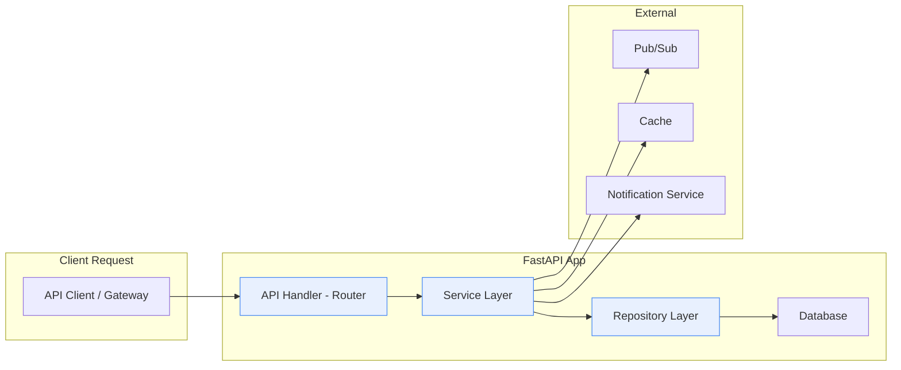

# 🛠️ Backend Dev Guide – dx-vas

Tài liệu này dành cho lập trình viên backend trong hệ thống dx-vas. Mục tiêu là cung cấp quy chuẩn và hướng dẫn chi tiết về cách phát triển service backend: cấu trúc thư mục, phân tầng logic, xử lý nghiệp vụ, viết test, và thực thi các tiêu chuẩn chất lượng code.

---

## Mục lục

1. [Phạm vi & nguyên tắc](#1-phạm-vi--nguyên-tắc)
2. [Cấu trúc thư mục backend chuẩn](#2-cấu-trúc-thư-mục-backend-chuẩn)
3. [Phân tầng logic & vai trò](#3-phân-tầng-logic--vai-trò)
4. [Đặt tên & convention code](#4-đặt-tên--convention-code)
5. [Xử lý nghiệp vụ & usecase mẫu](#5-xử-lý-nghiệp-vụ--usecase-mẫu)
6. [Schema & validation (Pydantic)](#6-schema--validation-pydantic)
7. [Xử lý lỗi & thông báo](#7-xử-lý-lỗi--thông-báo)
8. [Repository & truy xuất dữ liệu](#8-repository--truy-xuất-dữ-liệu)
9. [Pub/Sub subscriber & idempotency](#9-pubsub-subscriber--idempotency)
10. [Test đơn vị & tích hợp](#10-test-đơn-vị--tích-hợp)
11. [Checklist khi tạo PR backend](#11-checklist-khi-tạo-pr-backend)
12. [Tài liệu liên quan](#12-tài-liệu-liên-quan)

---

## 1. Phạm vi & nguyên tắc

Tài liệu này dành riêng cho các thành viên phát triển backend trong hệ thống dx-vas – nơi mọi service backend được viết theo kiến trúc microservice, mỗi service là 1 repo riêng biệt (multi-repo), triển khai qua Cloud Run.

Mục tiêu chính:

- Làm rõ cách phân tầng, tổ chức logic nghiệp vụ
- Chuẩn hóa cách viết schema, xử lý lỗi và truy cập DB
- Đảm bảo testability, maintainability và khả năng mở rộng của codebase

### ✳️ Nguyên tắc cốt lõi

1. **Tách rõ domain logic khỏi framework** (FastAPI chỉ là adapter)
2. **Mỗi service phải dễ test từng tầng độc lập**
3. **Không để logic nghiệp vụ rò rỉ vào controller (route handler)**
4. **Tránh hardcode – dùng config & DI hợp lý**
5. **Phân biệt rõ DTO (schema), model, entity và context**
6. **Tôn trọng đơn nhiệm – mỗi hàm/class có 1 vai trò**

📎 Tài liệu này không lặp lại CI/CD hay cấu trúc repo (đã có ở Dev Guide), mà tập trung vào:
- Usecase backend (handlers, service, repo)
- Convention phân tầng
- Test và best practice

---

## 2. Cấu trúc thư mục backend chuẩn

Tất cả các service backend trong dx-vas nên tuân theo cấu trúc thư mục chuẩn dưới đây để đảm bảo tính nhất quán và dễ bảo trì:

```

app/
├── api/              # Router, route handler (FastAPI)
│   └── v1/
│       └── user.py   # Endpoint định nghĩa HTTP
├── schemas/          # Pydantic schema (request, response)
│   └── user.py
├── services/         # Business logic (Usecase Layer)
│   └── user\_service.py
├── repositories/     # Truy cập DB, ORM / SQL
│   └── user\_repo.py
├── models/           # SQLAlchemy model (DB mapping)
│   └── user.py
├── core/             # Cấu hình, DI, security
│   ├── config.py
│   └── security.py
├── events/           # Xử lý Pub/Sub
│   ├── subscriber/   # Nhận sự kiện, xử lý
│   └── publisher/    # Gửi sự kiện đi
├── deps.py           # Dependency Injection (DB, current\_user...)
└── main.py           # Entry point FastAPI

```

### 📌 Một số quy ước chung

- `services/` chỉ chứa logic nghiệp vụ, không gọi trực tiếp DB hay HTTP
- `repositories/` là lớp duy nhất tương tác trực tiếp với DB
- `schemas/` chỉ dùng cho request/response – không dùng làm entity hoặc DB model
- `events/` có thể chia nhỏ thành `subscriber/`, `publisher/` nếu cần

### 📎 Gợi ý

- Nếu service có phần xử lý RBAC riêng → có thể thêm `rbac/`
- Nếu cần chia nhỏ service lớn (VD: SIS Adapter) → chia thành module theo domain (`student/`, `classroom/`, `fee/`)

### 🔧 Quản lý Dependency (deps.py)

Tập tin `deps.py` là nơi định nghĩa các **provider function** để inject dependency như `db_session`, `current_user`, hoặc `service instance` vào các route.

Ví dụ:

```python
def get_db() -> Generator:
    session = SessionLocal()
    try:
        yield session
    finally:
        session.close()

def get_user_service(db: Session = Depends(get_db)) -> UserService:
    return UserService(UserRepo(db))
```

> 📎 Tách riêng các provider vào deps.py giúp dễ tái sử dụng, test và thay thế (mock).

---

## 3. Phân tầng logic & vai trò

dx-vas áp dụng mô hình **3-layer architecture** cho backend, nhằm tách biệt rõ ràng giữa:

1. **Presentation Layer (API Handler)** – tiếp nhận request từ client
2. **Service Layer (Usecase)** – xử lý logic nghiệp vụ
3. **Data Layer (Repository)** – truy xuất dữ liệu từ DB hoặc bên thứ ba

---

### 🧱 Tầng 1: API Handler (`app/api/`)

- Nơi định nghĩa các route, sử dụng FastAPI router
- Gọi service layer, validate input, trả response
- Không chứa logic nghiệp vụ hoặc xử lý dữ liệu phức tạp

```python
@router.get(\"/users/{id}\", response_model=UserOut)
def get_user(id: UUID, user_svc: UserService = Depends(get_user_service)):
    return user_svc.get_user(id)
````

#### 📎 Ghi chú về Dependency

Biến `user_svc: UserService = Depends(get_user_service)` sử dụng Dependency Injection (DI) của FastAPI. Hàm `get_user_service` thường được định nghĩa như sau:

```python
# deps.py
def get_user_service(db: Session = Depends(get_db)) -> UserService:
    repo = UserRepo(db)
    return UserService(repo)
```

> ✅ Điều này giúp tách rõ logic khởi tạo và inject các thành phần như session, repository, và service – hỗ trợ test và maintain dễ dàng.

---

### ⚙️ Tầng 2: Service Layer (`app/services/`)

* Nơi xử lý toàn bộ logic nghiệp vụ: validate rule, xử lý business exception, gọi repository
* Được test riêng bằng unit test
* Không gọi trực tiếp HTTP, DB, FastAPI context

```python
class UserService:
    def __init__(self, user_repo: UserRepo):
        self.repo = user_repo

    def get_user(self, id: UUID) -> UserOut:
        user = self.repo.get(id)
        if not user:
            raise UserNotFound()
        return user
```

---

### 🗃️ Tầng 3: Repository Layer (`app/repositories/`)

* Tương tác với DB qua SQLAlchemy / SQLModel
* Là nơi duy nhất được gọi DB query trực tiếp
* Có thể chia nhỏ theo entity

```python
class UserRepo:
    def __init__(self, session: Session):
        self.session = session

    def get(self, id: UUID) -> Optional[User]:
        return self.session.query(User).filter(User.id == id).first()
```

---

### 💡 Lưu ý bổ sung

| Thành phần | Được phép gọi   | Không được gọi  |
| ---------- | --------------- | --------------- |
| Handler    | Service, Schema | Repo, Model     |
| Service    | Repo, Schema    | Handler, DB     |
| Repo       | Model           | Schema, Service |

> ✅ Mô hình này giúp dễ test, dễ refactor, và dễ scale từng tầng khi cần.

> 📎 Service Layer nên trả về DTO (Pydantic Schema), không trả trực tiếp SQLAlchemy model.  

> Điều này giúp API Handler tách biệt khỏi ORM logic và tăng khả năng test.

> 📌 Nếu usecase nghiệp vụ yêu cầu nhiều bước (update + audit + gửi event), hãy cân nhắc tổ chức thành context hoặc pattern Unit of Work để đảm bảo rollback đồng bộ nếu có lỗi.

---

### 📊 Sơ đồ kiến trúc 3-layer – luồng xử lý điển hình trong một backend service



📌 Sơ đồ mô tả rõ flow xử lý từ API Gateway → Handler → Service → Repo → DB
Các call phụ như Pub/Sub, Cache, hoặc Notification thường xuất phát từ Service Layer.

---

## 4. Đặt tên & convention code

Việc đặt tên rõ ràng, nhất quán giúp code dễ đọc, dễ review và dễ bảo trì. dx-vas sử dụng convention theo kiểu **snake_case cho file/biến**, **CamelCase cho class**, và **lowercase-with-dash cho route**.

---

### 📁 Tên file & thư mục

| Loại | Quy tắc | Ví dụ |
|------|---------|-------|
| Thư mục module | snake_case | `user_service/`, `classroom/` |
| File schema | snake_case | `user.py`, `role.py` |
| File repo/service | snake_case | `user_repo.py`, `user_service.py` |

> 📎 Nếu microservice có nhiều domain (VD: SIS Adapter) → nên chia theo module con:  
> `app/student/schemas/`, `app/student/services/`, `app/student/repositories/`  
> Khi đó, mỗi module sẽ có thư mục `services/`, `schemas/` riêng thay vì dùng thư mục cấp cao.

---

### 🔤 Tên class

| Loại | Quy tắc | Ví dụ |
|------|--------|-------|
| Pydantic schema | CamelCase | `UserCreate`, `RoleOut` |
| Service | CamelCase | `UserService`, `PermissionService` |
| SQLAlchemy model | CamelCase | `User`, `Classroom` |
| Exception | CamelCase + `Error` | `UserNotFoundError` |

---

### 🌐 Đặt tên route (API path)

- Lowercase, nối bằng `-`, dùng danh từ
- Phiên bản hóa bằng prefix `/v1`
- Hành động thể hiện qua method: GET/POST/PATCH/DELETE

| Mục tiêu | Method | Route |
|----------|--------|--------|
| Lấy user | GET | `/v1/users/{id}` |
| Tạo mới user | POST | `/v1/users` |
| Cập nhật user | PATCH | `/v1/users/{id}` |
| Xoá user | DELETE | `/v1/users/{id}` |

---

### 💬 Tên biến & hàm

- snake_case cho biến, hàm, argument
- Tên nên rõ ràng, không viết tắt khó hiểu

| Không nên | Nên dùng |
|-----------|----------|
| `u`, `res` | `user`, `response` |
| `get()` | `get_user_by_id()` |
| `svc` | `user_service` |

---

📎 Tham khảo convention PEP8 + Black formatting (auto format được trong CI/CD).

---

## 5. Xử lý nghiệp vụ & usecase mẫu

Tầng Service (Usecase Layer) là nơi xử lý logic nghiệp vụ chính trong mỗi service. Các class ở tầng này cần độc lập với framework (FastAPI, SQLAlchemy...) và có thể được test đơn lẻ.

---

### 🧩 Một usecase mẫu – Cập nhật thông tin học sinh

Giả sử route PATCH `/students/{id}` nhận thông tin cập nhật và gọi đến tầng Service như sau:

#### 1. Schema đầu vào (`schemas/student.py`)
```python
class StudentUpdate(BaseModel):
    name: Optional[str]
    birthday: Optional[date]
````

#### 2. API Handler (`api/v1/student.py`)

```python
@router.patch(\"/students/{id}\", response_model=StudentOut)
def update_student(id: UUID, payload: StudentUpdate, svc: StudentService = Depends(get_service)):
    return svc.update_student(id, payload)
```

#### 3. Service (`services/student_service.py`)

```python
class StudentService:
    def __init__(self, repo: StudentRepo):
        self.repo = repo

    def update_student(self, id: UUID, payload: StudentUpdate) -> StudentOut:
        student = self.repo.get(id)
        if not student:
            raise StudentNotFoundError()
        student.name = payload.name or student.name
        student.birthday = payload.birthday or student.birthday
        updated = self.repo.save(student)
        return StudentOut.from_orm(updated)
```

#### 4. Repository (`repositories/student_repo.py`)

```python
# repositories/student_repo.py

class StudentRepo:
    def __init__(self, session: Session):
        self.session = session

    def get(self, id: UUID) -> Optional[Student]:
        return self.session.query(Student).filter(Student.id == id).first()

    def save(self, student: Student) -> Student:
        self.session.add(student)
        return student

```

📎 Repo chỉ nên thực hiện add() hoặc update() và không gọi commit() – việc commit/rollback sẽ được xử lý bởi get_db() hoặc unit-of-work ở tầng trên.

---

### ✅ Ghi nhớ khi viết usecase

| Yêu cầu                                 | Giải thích                                              |
| --------------------------------------- | ------------------------------------------------------- |
| Không gọi trực tiếp DB trong service    | Luôn qua repository                                     |
| Không xử lý response trong service      | Service trả object/data, không `JSONResponse`           |
| Không raise HTTPException trong service | Chỉ raise `domain error`, handler sẽ map sang HTTP code |
| Logic rẽ nhánh nên rõ ràng              | Tránh if/else lồng quá sâu                              |

---

📎 Tham khảo mẫu toàn diện tại: [`dx-user-service`](https://github.com/vas-org/dx-user-service)

---

## 6. Schema & validation (Pydantic)

Tất cả request/response đầu vào ra của API trong dx-vas đều sử dụng **Pydantic schema** để đảm bảo type safety, validate dữ liệu và sinh tài liệu OpenAPI.

---

### 📦 Phân loại schema

| Mục đích | Đặt tên | Ví dụ |
|----------|---------|-------|
| Input từ request | `*Create`, `*Update`, `*In` | `UserCreate`, `StudentUpdate` |
| Output trả về | `*Out`, `*Response` | `UserOut`, `ScoreResponse` |
| DB schema (tuỳ chọn) | `*DB` | `UserDB` |
| Schema nội bộ | `*Payload`, `*Data` | `NotificationPayload` |

---

### ✅ Ví dụ schema – Student

```python
class StudentCreate(BaseModel):
    name: str = Field(..., min_length=2)
    birthday: date
    class_id: UUID

class StudentOut(BaseModel):
    id: UUID
    name: str
    birthday: date
    class_name: Optional[str]
````

---

### 🧪 Custom validator ví dụ

```python
class StudentCreate(BaseModel):
    name: str
    birthday: date

    @validator("name")
    def validate_name(cls, value):
        if not value.isalpha():
            raise ValueError("Tên chỉ được chứa chữ cái")
        return value
```

📎 Dùng @validator khi cần kiểm tra hoặc chuẩn hóa dữ liệu đầu vào – rất hữu ích cho rule nghiệp vụ như kiểm tra định dạng mã học sinh, tên không chứa số, v.v.

---

### ⚠️ Lưu ý khi dùng schema

* Dùng `Field(...)` để validate field rõ ràng
* Không đặt default = None nếu field bắt buộc
* Không dùng schema output làm model DB hoặc input
* Tránh schema quá sâu/lồng nhau phức tạp – nên tách nhỏ
* Nếu `orm_mode = True` → schema dùng được `.from_orm(obj)`

---

### 📎 Tips nâng cao

* Có thể kế thừa schema:

```python
class StudentBase(BaseModel):
    name: str
    birthday: date

class StudentCreate(StudentBase):
    class_id: UUID
```

* Tách riêng `PaginationMeta`, `ErrorEnvelope`... dùng chung toàn hệ thống tại `schemas/common.py`

> 📎 Nếu hệ thống dùng camelCase trong JSON response:
> ```python
> class Config:
>     alias_generator = lambda s: ''.join(
>         word.capitalize() if i else word for i, word in enumerate(s.split('_'))
>     )
>     allow_population_by_field_name = True
> ```


---

📎 Schema chuẩn của toàn hệ thống được định nghĩa tại:
[`dx-service-template/schemas/common.py`](https://github.com/vas-org/dx-service-template)

---

## 7. Xử lý lỗi & thông báo

dx-vas chuẩn hoá cơ chế xử lý lỗi để API consistent, dễ debug và dễ theo dõi log. Mỗi service đều trả về lỗi theo dạng `ErrorEnvelope` chuẩn và sử dụng exception theo từng tầng.

---

### 🚧 Cấu trúc lỗi chuẩn

```json
{
  "error": {
    "code": "USER_NOT_FOUND",
    "message": "Người dùng không tồn tại",
    "details": null
  },
  "meta": {
    "request_id": "abc-xyz-123",
    "timestamp": "2025-06-01T12:00:00Z"
  }
}
````

---

### 💢 Phân tầng xử lý lỗi

| Tầng         | Loại exception            | Ví dụ                                    |
| ------------ | ------------------------- | ---------------------------------------- |
| API (router) | HTTPException, 422        | FastAPI sẽ auto catch                    |
| Service      | DomainError               | `UserNotFoundError`, `InvalidScoreError` |
| Repo         | Optional + catch DB error | `SQLAlchemyError`, rollback              |

---

### 🧱 Base error dùng chung

```python
class DomainError(Exception):
    code = \"UNSPECIFIED_ERROR\"
    message = \"Có lỗi xảy ra\"

    def __init__(self, detail=None):
        self.detail = detail

class UserNotFoundError(DomainError):
    code = \"USER_NOT_FOUND\"
    message = \"Người dùng không tồn tại\"
```

Trong route handler:

```python
try:
    user = svc.get_user(id)
except DomainError as e:
    raise HTTPException(status_code=404, detail={
        \"code\": e.code,
        \"message\": e.message,
        \"details\": e.detail
    })
```

---

### 🔁 Mapping lỗi → mã HTTP

| Domain Error       | HTTP code |
| ------------------ | --------- |
| `NotFoundError`    | 404       |
| `ValidationError`  | 400       |
| `PermissionDenied` | 403       |
| `Conflict`         | 409       |
| `InternalError`    | 500       |

> ✅ Service không được raise `HTTPException`, mà chỉ raise domain-level error
> 📌 Có thể định nghĩa một global exception handler trong FastAPI để tự động map `DomainError` sang HTTPException với `ErrorEnvelope`, giúp code tại route gọn hơn:
>
> ```python
> @app.exception_handler(DomainError)
> async def domain_error_handler(request: Request, exc: DomainError):
>     return JSONResponse(
>         status_code=exc.status_code or 500,
>         content={
>             "error": {
>                 "code": exc.code,
>                 "message": exc.message,
>                 "details": exc.detail,
>             },
>             "meta": {
>                 "request_id": request.headers.get("X-Request-ID"),
>                 "timestamp": datetime.utcnow().isoformat()
>             }
>         }
>     )
> ```


---

📎 Mẫu `ErrorEnvelope`, `BaseError` có sẵn trong: [`dx-service-template/schemas/common.py`](https://github.com/vas-org/dx-service-template)

---

## 8. Repository & truy xuất dữ liệu

Repository là tầng duy nhất tương tác trực tiếp với cơ sở dữ liệu. Mục tiêu là tách biệt logic nghiệp vụ khỏi chi tiết truy vấn SQL hoặc ORM.

---

### 📦 Vai trò của repository

- Quản lý session DB (commit, rollback)
- Tương tác SQLAlchemy model
- Trả về entity/raw data, không map sang schema
- Có thể group theo domain (`student_repo.py`, `classroom_repo.py`)

---

### 🧱 Mẫu repository – StudentRepo

```python
class StudentRepo:
    def __init__(self, session: Session):
        self.session = session

    def get_by_id(self, id: UUID) -> Optional[Student]:
        return self.session.query(Student).filter(Student.id == id).first()

    def create(self, student: Student) -> Student:
        self.session.add(student)
        return student

    def update(self, student: Student) -> Student:
        return student


    def list_by_class(self, class_id: UUID) -> List[Student]:
        return self.session.query(Student).filter(Student.class_id == class_id).all()
````

---

### 🧯 Lưu ý

| Quy tắc                                                         | Giải thích                      |
| --------------------------------------------------------------- | ------------------------------- |
| Không trả về Pydantic schema                                    | Chỉ trả về SQLAlchemy model     |
| Không gọi schema trong repo                                     | Repo không biết gì về tầng trên |
| Luôn kiểm soát session commit                                   | Không để service tự commit DB   |
| Transaction nhiều bước → gói lại bằng context hoặc unit of work | Tránh lỗi rollback thiếu bước   |

---

### 🛠 Tạo session DB

```python
def get_db() -> Generator:
    session = SessionLocal()
    try:
        yield session
        session.commit()
    except:
        session.rollback()
        raise
    finally:
        session.close()
```

Trong service:

```python
# Trong FastAPI handler
@router.get("/students/{id}", response_model=StudentOut)
def get_student_api_handler(id: UUID, student_svc: StudentService = Depends(get_student_service)):
    student = student_svc.get_student_by_id(id)
    if not student:
        raise StudentNotFoundError()
    return StudentOut.from_orm(student)

```

> 📎 StudentService và StudentRepo nên được khởi tạo thông qua DI – hoặc thông qua hàm get_student_service() như mô tả ở Mục 3.

---

📎 DB schema → xem `models/student.py`

📎 Cấu hình DB trong `core/config.py`, session ở `deps.py`

---

## 9. Pub/Sub subscriber & idempotency

Một số service backend của dx-vas hoạt động theo mô hình event-driven – nghĩa là nhận sự kiện từ các topic Pub/Sub và xử lý bất đồng bộ. Việc đảm bảo **idempotency** (xử lý lặp lại không gây lỗi) là bắt buộc.

---

### 📦 Cấu trúc thư mục gợi ý

```

events/
├── subscriber/
│   └── user\_event\_handler.py
├── publisher/
│   └── notify\_event.py

````

---

### 📥 Viết một subscriber handler

> 📎 Schema bảng `processed_messages`:
> ```sql
> CREATE TABLE processed_messages (
>   message_id VARCHAR(255) PRIMARY KEY,
>   processed_at TIMESTAMP DEFAULT CURRENT_TIMESTAMP,
>   status VARCHAR(50) DEFAULT 'success'
> );
> ```

```python
def handle_user_created(message: PubSubMessage):
    db_session_event = SessionLocal()
    try:
        repo = UserRepo(db_session_event)
        data = json.loads(message.data.decode("utf-8"))
        user_id = data["user_id"]

        if repo.has_processed(message.message_id):
            return

        user = repo.get(user_id)
        if not user:
            raise UserNotFoundError()

        # ... xử lý sự kiện ...

        repo.mark_processed(message.message_id)
        db_session_event.commit()
    except Exception:
        db_session_event.rollback()
        raise
    finally:
        db_session_event.close()

````

> ✅ Sử dụng SessionLocal() riêng cho background worker, đảm bảo quản lý transaction tách biệt với request.

---

### 🧪 Idempotency: cách đảm bảo

| Kỹ thuật                              | Ghi chú                                   |
| ------------------------------------- | ----------------------------------------- |
| Ghi log message đã xử lý              | Tạo bảng `processed_messages(message_id)` |
| Tránh logic gây side effect nhiều lần | Gửi noti 1 lần, tạo record 1 lần          |
| Transaction toàn bộ handler           | Commit/rollback toàn phần                 |
| Retry-safe                            | Nếu lỗi do mạng → message sẽ được retry   |

---

### 🧭 Framework hỗ trợ

* Google Pub/Sub client (`google-cloud-pubsub`)
* Wrapper: `pubsub_fastapi`, `pubsub-consumer` custom
* Có thể tích hợp vào background task trong `main.py`

---

### 🧼 Cleanup

* Dùng TTL hoặc cronjob để xoá bản ghi `processed_messages` cũ
* Có thể dùng Redis thay DB nếu cần tốc độ cao và lưu ngắn hạn

---

📎 Mẫu event flow: [System Diagrams](../architecture/system-diagrams.md#5-data-synchronization-flow--đồng-bộ-học-sinh-crm--sis--lms)

📎 Quy ước Pub/Sub topic: [Dev Ops Guide](./ops-guide.md#8-quản-lý-pubsub--dead-letter)

---

## 10. Test đơn vị & tích hợp

Viết test là bắt buộc trong mỗi backend service. dx-vas ưu tiên **unit test cho service layer** và **integration test cho route + DB + Pub/Sub**.

---

### 🧪 Cấu trúc thư mục test

```

tests/
├── unit/
│   └── test\_user\_service.py
├── integration/
│   ├── test\_user\_routes.py
│   └── test\_pubsub\_event.py
├── conftest.py

````

---

### ✅ Unit test – Service không phụ thuộc DB

```python
def test_get_user_success():
    fake_repo = MagicMock()
    fake_repo.get.return_value = User(id=1, name=\"John\")

    svc = UserService(fake_repo)
    result = svc.get_user(1)

    assert result.name == \"John\"
````

* Dùng `MagicMock` để mô phỏng repository
* Không cần DB hoặc HTTP client
* Chạy nhanh, dễ debug

---

### 🔁 Integration test – Route + DB

```python
def test_create_user(client, db_session):
    payload = {\"name\": \"John\"}
    response = client.post(\"/v1/users\", json=payload)
    assert response.status_code == 201
```

* Dùng `TestClient` của FastAPI + session test DB
* Có thể seed dữ liệu bằng fixture

---

### 🧩 Pytest fixture gợi ý (`conftest.py`)

```python
@pytest.fixture
def db_session():
    session = SessionLocal()
    yield session
    session.rollback()
    session.close()

@pytest.fixture
def client():
    from app.main import app
    return TestClient(app)
```

---

### 💡 Lưu ý khi viết test

| Nguyên tắc                | Giải thích                              |
| ------------------------- | --------------------------------------- |
| Tên test rõ ràng          | `test_create_user_fail_invalid_email()` |
| Test không phụ thuộc nhau | Không dùng shared global state          |
| Bao phủ logic rẽ nhánh    | Test success, fail, edge case           |
| Mock đúng chỗ             | Repo, API external, Pub/Sub client      |

---

📎 Coverage tối thiểu yêu cầu: 85% cho unit, 70% cho integration
📎 Lệnh test mẫu:

```bash
make test
pytest tests/unit/
pytest --cov=app
```

---

## 11. Checklist khi tạo PR backend

Mỗi Pull Request (PR) backend trong dx-vas cần tuân theo checklist sau để đảm bảo chất lượng, tính nhất quán và tránh lỗi khi merge vào nhánh chính.

---

### ✅ Checklist kỹ thuật

- [ ] Tên PR rõ ràng, theo format: `[feature] Add create student usecase`
- [ ] Code đã format bằng Black / isort / lint pass
- [ ] Đã thêm unit test cho logic nghiệp vụ
- [ ] Đã thêm integration test cho API / DB / PubSub
- [ ] Đảm bảo test pass (`make test`, CI green)
- [ ] Không commit `.env`, file secret hoặc credential
- [ ] Không hardcode config, API key trong code
- [ ] Schema đầu vào có validate đầy đủ (Pydantic)
- [ ] Error trả về đúng `ErrorEnvelope` chuẩn

---

### 📎 Checklist logic nghiệp vụ

- [ ] Nếu có sửa DB → đã viết migration
- [ ] Nếu thêm permission → cập nhật file RBAC `permissions.yaml`
	📎 Xem cách định nghĩa permission tại [RBAC Deep Dive](../architecture/rbac-deep-dive.md#5-permission-có-điều-kiện-condition-jsonb)
- [ ] Nếu thay đổi API → cập nhật OpenAPI / Interface Contracts
- [ ] Nếu ảnh hưởng cross-service → đã thông báo/ghi chú rõ
- [ ] Nếu cần sync dữ liệu → viết rõ flow trong commit message

---

### 🔍 Gợi ý review

- Xem flow từ API → Service → Repo → Test
- Xem logging có đúng cấp độ, không log sensitive
- Xem logic rẽ nhánh đầy đủ chưa (success, fail, edge case)
- Comment rõ TODO nếu còn dở dang (và ghi task follow-up)

---

📎 Format commit message → xem Dev Guide  

📎 Quản lý permission → xem RBAC Deep Dive  

📎 Migration & version DB → xem Dev Ops Guide mục 7

---

## 12. Tài liệu liên quan

Dưới đây là các tài liệu nội bộ hỗ trợ cho quá trình phát triển backend trong hệ thống dx-vas. Developer nên tham khảo đầy đủ để nắm được toàn bộ bức tranh kiến trúc, quy trình CI/CD, RBAC, interface contracts, và vận hành.

---

### 📚 Tài liệu kiến trúc & luồng hệ thống

| Tài liệu | Mục tiêu |
|---------|----------|
| [System Diagrams](../architecture/system-diagrams.md) | Tổng quan kiến trúc, sơ đồ các luồng nghiệp vụ |
| [RBAC Deep Dive](../architecture/rbac-deep-dive.md) | Kiến trúc RBAC động, JSONB, phân quyền & cache |
| [Interface Contracts](../interfaces/) | Định nghĩa OpenAPI + schema liên service |

---

### 🧪 Dev Guide & CI/CD

| Tài liệu | Mục tiêu |
|---------|----------|
| [Dev Guide](./dev-guide.md) | Hướng dẫn CI/CD, test, lint, docker hóa, PR flow |
| [Dev Ops Guide](./ops-guide.md) | Hướng dẫn vận hành: Cloud Run, Redis, Pub/Sub |
| [ADR Index](../ADR/index.md) | Danh sách các quyết định kiến trúc quan trọng |

---

### 🛠 Service template & example

| Repo | Vai trò |
|------|---------|
| [`dx-service-template`](https://github.com/vas-org/dx-service-template) | Mẫu service chuẩn (FastAPI, pubsub, test, CI) |
| [`dx-user-service`](https://github.com/vas-org/dx-user-service) | Triển khai mẫu: RBAC, JWT, user CRUD |
| [`dx-notification-service`](https://github.com/vas-org/dx-notification-service) | Gửi thông báo Web/Zalo/Email, Pub/Sub event-driven |

---

📎 Developer mới nên đọc theo thứ tự:

1. `backend-dev-guide.md` (tài liệu này)
2. System Diagrams → RBAC Deep Dive
3. Dev Guide → Dev Ops Guide

---

## 13. Logging Best Practices

Hệ thống nên sử dụng logging chuẩn với các nguyên tắc sau để đảm bảo khả năng giám sát và trace dễ dàng:

### 🔍 Cấp độ log

| Level     | Mục đích                              |
|-----------|----------------------------------------|
| DEBUG     | Chi tiết kỹ thuật để debug (không log ở production) |
| INFO      | Bước xử lý chính, hành vi người dùng |
| WARNING   | Bất thường không gây lỗi               |
| ERROR     | Lỗi nghiêm trọng, nên có traceback    |

### 📦 Cấu trúc log

- Dùng structured log (JSON format) → dễ tích hợp với Cloud Logging
- Bao gồm `request_id`, `user_id` nếu có thể
- Log theo trace-id nếu dùng OpenTelemetry hoặc tương tự

### 🧭 Gợi ý log theo tầng

| Tầng      | Log gì                                |
|-----------|----------------------------------------|
| Handler   | Bắt đầu/kết thúc xử lý request, input |
| Service   | Bước nghiệp vụ quan trọng, điều kiện phân nhánh |
| Repo      | Truy vấn đặc biệt hoặc lỗi DB         |

> 📎 Không log dữ liệu nhạy cảm (password, token, email học sinh...)

---

## 14. Security Considerations – Cân nhắc bảo mật cho Backend

### 🔐 Nguyên tắc cốt lõi

- **Security by Design:** Bảo mật không phải là tính năng phụ trợ – nó phải được tích hợp ngay từ kiến trúc và quy trình phát triển.
- **Zero Trust**: Không giả định bất kỳ nguồn dữ liệu nào là an toàn, kể cả từ nội bộ.

---

### 🧪 Input validation & Sanity Check

- **Luôn dùng Pydantic Schema** để kiểm soát input cho API & Pub/Sub.
- **Validation bổ sung ở tầng Service** nếu logic phức tạp hơn (ví dụ: chỉ giáo viên chủ nhiệm mới sửa điểm).
- **Không tin tưởng payload nội bộ** – không được skip validation khi nhận request từ API Gateway hoặc từ event Pub/Sub.

---

### 🔐 Quản lý secret & cấu hình an toàn

- **Không bao giờ commit file `.env`** hoặc biến môi trường chứa token, DB URL, v.v.
- **Secrets nên được quản lý qua**:
  - Google Secret Manager (hoặc `doppler`, `Vault` nếu dùng self-hosted)
  - Inject vào môi trường Cloud Run qua `env var` hoặc `mount volume`
- Tách biệt `config.py` chứa biến công khai và `env var` chứa thông tin nhạy cảm.

---

### 📦 Token & phân quyền

- Không decode token JWT tại backend nếu đã có API Gateway kiểm tra rồi – thay vào đó:
  - **Tin tưởng `X-User-ID`, `X-User-Role`, `X-Permissions`** được Gateway gắn vào header đã được ký (`X-Signature`)
  - **Không dùng token client-side trực tiếp gọi vào backend** – mọi truy cập bắt buộc qua Gateway.

---

### 📛 OWASP API Security – Các lỗ hổng cần đề phòng

| Vấn đề | Biện pháp |
|--------|-----------|
| Injection | Dùng ORM (SQLAlchemy), tránh query raw nếu không escape |
| Broken Auth | Không dùng xác thực riêng tại backend – chỉ kiểm tra phân quyền |
| Excessive Data Exposure | Dùng `response_model` để giới hạn dữ liệu trả ra |
| Improper Asset Mgmt | Không expose `/docs`, `/openapi.json` trên production |
| Lack of Rate Limit | Đã xử lý ở API Gateway, nhưng vẫn cần audit log local |

---

### 🧯 Logging & Auditing

- Không log dữ liệu nhạy cảm (email học sinh, mã OTP, token).
- Luôn log `request_id`, `user_id`, `endpoint`, và `status`.
- Xem thêm phần [`13. Logging Best Practices`](#13-logging-best-practices)

---

📌 Xem thêm chính sách bảo mật toàn hệ thống tại ADR: [`adr-004-security.md`](../ADR/adr-004-security.md)

---

## 15. Performance Tips – Tối ưu hiệu năng Backend

Hiệu năng hệ thống không chỉ phụ thuộc vào hạ tầng mà còn bị ảnh hưởng trực tiếp bởi cách viết code ở tầng service và repository.

---

### 📥 Truy vấn DB hiệu quả

| Mẹo | Ghi chú |
|-----|--------|
| Dùng `.limit()` thay vì `.all()` nếu dữ liệu nhiều | Tránh load toàn bộ bảng vào RAM |
| Dùng `selectinload()` hoặc `joinedload()` khi cần truy cập nhiều bản ghi liên quan | Tránh N+1 query |
| Tránh `.count()` trong bảng lớn | Nếu có thể, dùng limit + exists/check |
| Tách các truy vấn phân tích/phức tạp ra background | Tránh block API request |

---

### 📤 Caching nếu cần thiết

- **Không nên cache sớm** – chỉ cache khi thấy rõ bottleneck
- Ưu tiên cache kết quả `read-only` (VD: danh sách ngành học)
- Dùng Redis hoặc local in-memory cache (VD: `lru_cache`) nếu phù hợp
- Cẩn trọng với cache invalidation nếu dữ liệu thường xuyên thay đổi

---

### 🪄 Tối ưu luồng xử lý

| Kỹ thuật | Dùng khi nào |
|---------|---------------|
| `BackgroundTasks` (FastAPI) | Gửi email, sync webhook, audit, log external |
| `Pub/Sub` hoặc message queue | Tách các hành động không cần blocking user |
| Batch insert/update | Nếu cần ghi hàng loạt (VD: điểm học sinh) |

---

### 🧮 Giảm thiểu I/O Blocking

- Luôn dùng `async def` ở API handler nếu gọi I/O (DB, HTTP)
- Tránh các blocking call trong async context (VD: `requests.get()` → dùng `httpx.AsyncClient`)

---

### 🧪 Đo lường và theo dõi

- Dùng `OpenTelemetry` để trace request & đo thời gian xử lý từng tầng
- Đo `latency` và `throughput` theo từng API
- Giám sát số lượng request lỗi (5xx), timeout, và retry qua các biểu đồ Cloud Monitoring

---

📌 Xem thêm cấu trúc log và trace tại Mục [`13. Logging`](#13-logging-best-practices) và cấu hình hạ tầng tại [Dev Ops Guide](./ops-guide.md)

---