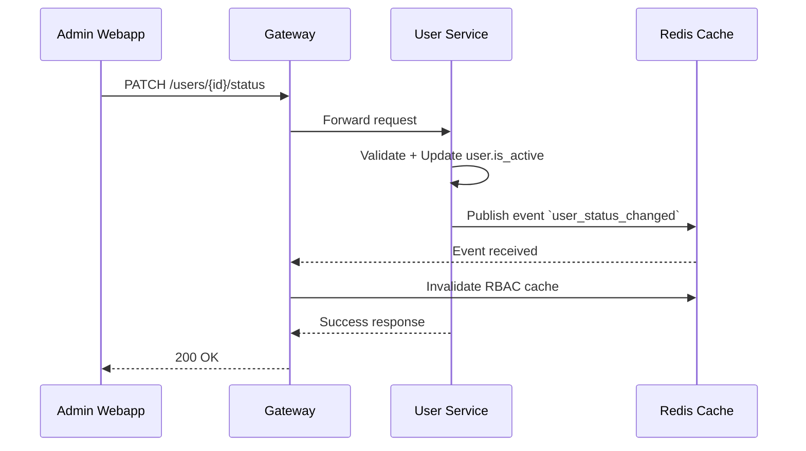

# User Service Design Document

## 1. Scope & Responsibilities

The **User Service** is a core service in the dx\_vas ecosystem, responsible for managing all user-related data and logic. It is the source of truth for user identity, roles, permissions, and their lifecycle status. All services requiring user authentication, authorization, or context will depend on this service.

### Core Responsibilities:

* Manage user entities: creation, update, deactivation, and logical deletion.
* Provide role & permission assignment and querying.
* Emit events when user status or RBAC changes.
* Serve user data to other services via API Gateway.
* Act as the RBAC source-of-truth for the Gateway's permission evaluation engine.

### Out of Scope:

* Authentication/token issuance (handled by Auth Service).
* Notification (delegated to Notification Service).

---

## 2. API Specification (OpenAPI)

API contract is defined in `docs/interfaces/user-service/openapi.yaml`

* Format: OpenAPI 3.0.3
* Exposed endpoints:

  * `GET /users`
  * `GET /users/{id}`
  * `POST /users`
  * `PATCH /users/{id}`
  * `PATCH /users/{id}/status`
  * `GET /users/{id}/permissions`
  * `GET /roles`, `GET /roles/{id}`
  * `GET /permissions`, `GET /permissions/{code}`
  * ... (see YAML file for details)

---

## 3. Data Model

### Tables:

* `users`
* `roles`
* `permissions`
* `user_role` (many-to-many)
* `role_permission` (many-to-many)

Each permission may include a `condition` JSONB field used in RBAC evaluation.

See `docs/services/user-service/data-model.md` (to be created) for schema details.

---

## 4. Business Logic Flows

### Example: Change User Status



More flows will be added as implementation progresses.

---

## 5. Events

### Published Events:

* `user_status_changed`: on activation/deactivation
* `rbac_updated`: on any change to roles/permissions of a user

Events follow dx\_vas Pub/Sub contract. Payload schema:

```json
{
  "user_id": "UUID",
  "event": "rbac_updated",
  "triggered_by": "admin_id"
}
```

---

## 6. RBAC & Permissions

* RBAC is fully managed here.
* User Service maps users to roles, roles to permissions.
* Each permission has `code`, `resource`, `action`, and optional `condition`.
* Used by Gateway to evaluate access via header `X-Permissions`.
* Updates to RBAC trigger cache invalidation and event emission.

See: `rbac-deep-dive.md` for deep logic, JSONB `condition` schema, etc.

---

## 7. Config & Secrets

### Required:

* `POSTGRES_DSN`
* `REDIS_URL`
* `JWT_PUBLIC_KEY` (for internal token validation)

### Optional:

* `ENABLE_AUDIT_LOG=true`

---

## 8. Testing Strategy

### Unit Tests:

* Service logic: `UserService`, `RoleService`, etc.
* Validation logic, permission schema resolution

### Integration Tests:

* Full endpoint tests (via FastAPI `TestClient`)
* RBAC flows, cache invalidation behavior

Fixtures for test DB and Redis mock will be included.

---

## Next Steps

* Create `data-model.md`
* Complete OpenAPI YAML (ensure sync with implemented handlers)
* Review `dx-service-template` for conformance
* Start implementation based on this design
