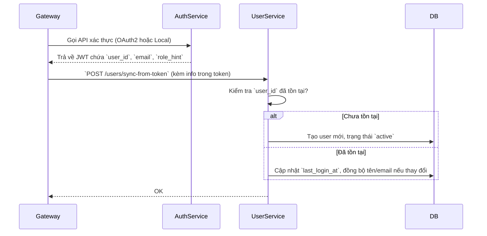
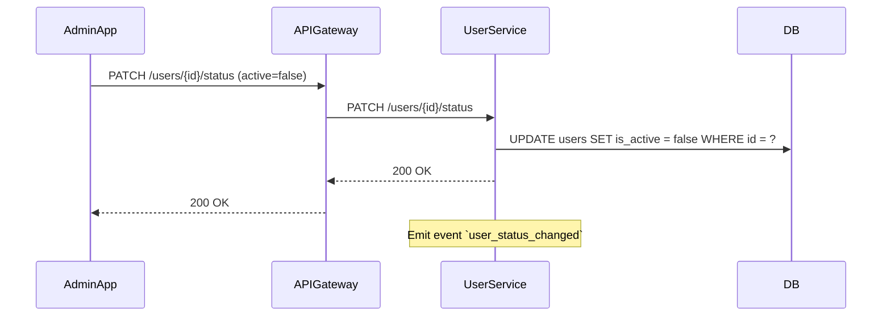
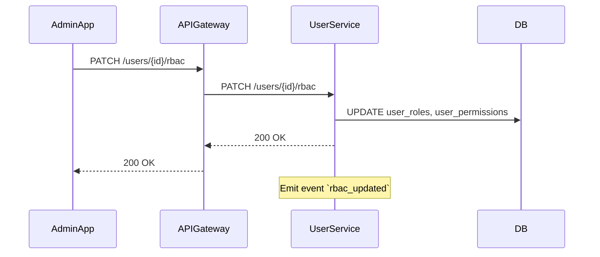
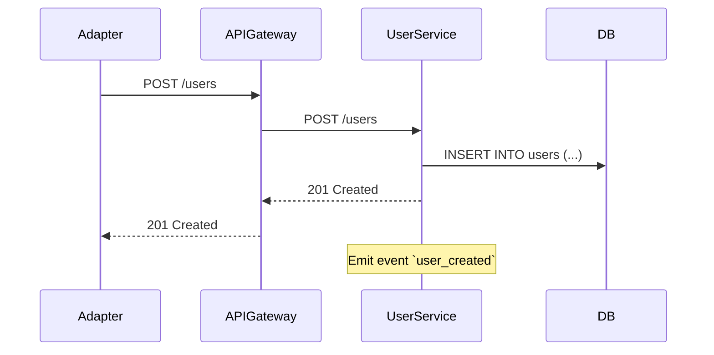

# User Service – Thiết kế chi tiết

## 1. Scope & Responsibilities

**Mô tả ngắn:**
User Service là service cốt lõi của hệ thống dx-vas, chịu trách nhiệm quản lý thông tin định danh, trạng thái và phân quyền người dùng (RBAC). Đây là trung tâm phân quyền động (condition-based), là nơi duy nhất ghi nhận user-role-permission mapping.

### Trách nhiệm chính:

- Quản lý dữ liệu định danh người dùng:
  - `user_id`, `name`, `email`, `type`, `status`, `created_at`, `updated_at`
- Quản lý trạng thái tài khoản: `pending`, `active`, `inactive`, `deleted`
- Phân quyền động (RBAC):
  - Quản lý `roles`, `permissions`
  - Mapping user → roles → permissions (với `condition`)
- Cung cấp API cho API Gateway kiểm tra quyền (qua Redis hoặc API fallback)
- Phát sự kiện `rbac_updated`, `user_status_changed` để đồng bộ RBAC cache tại Gateway

### Không chịu trách nhiệm:

- Đăng nhập / xác thực người dùng (thuộc Auth Service)
- Gửi thông báo (thuộc Notification Service)
- Truy xuất thông tin học sinh / phụ huynh (thuộc SIS)

### Tích hợp:

- Redis Cache: để đẩy RBAC user snapshot phục vụ API Gateway
- Pub/Sub: để publish các sự kiện `user_status_changed`, `rbac_updated`
- Cloud SQL (PostgreSQL): lưu trữ dữ liệu chính

---

## 2. API Specification

Các API của User Service được định nghĩa chi tiết trong file OpenAPI tại:
👉 [`openapi.yaml`](../../../openapi/user-service/openapi.yaml)

### Mô tả tổng quan:

| Method | Path                          | Mô tả ngắn                                        |
|--------|-------------------------------|--------------------------------------------------|
| GET    | `/users`                      | Lấy danh sách người dùng, có phân trang & lọc   |
| POST   | `/users`                      | Tạo người dùng mới (chỉ dành cho Admin Service) |
| GET    | `/users/{id}`                | Lấy chi tiết người dùng                          |
| PATCH  | `/users/{id}`                | Cập nhật thông tin người dùng                    |
| PATCH  | `/users/{id}/status`         | Cập nhật trạng thái hoạt động (is_active)       |
| GET    | `/users/{id}/permissions`    | Lấy danh sách quyền của user (gồm condition)    |
| GET    | `/users/{id}/permissions/raw`| Lấy full RBAC raw (roles, permissions, mapping) |

### Quy ước trả về:

- Tuân theo cấu trúc chuẩn đã mô tả trong `backend-dev-guide.md`
- Luôn bọc kết quả trong `DataEnvelope`, lỗi trong `ErrorEnvelope`
- Mã lỗi được định nghĩa thống nhất trong hệ thống (4xx, 5xx)

### Bảo mật & phân quyền:

- Các endpoint yêu cầu JWT hợp lệ từ Gateway
- Một số endpoint yêu cầu `X-Permissions` tương ứng (`user:read`, `user:update`, `rbac:view`, v.v.)
- RBAC được kiểm tra bởi Gateway dựa trên dữ liệu từ Redis hoặc fallback qua `GET /users/{id}/permissions`

📌 Chi tiết schema input/output vui lòng xem tại [`openapi.yaml`](../../../openapi/user-service/openapi.yaml)

---

## 3. Data Model

📄 Chi tiết bảng CSDL được mô tả trong [`data-model.md`](./data-model.md)

### Tổng quan các bảng chính:

| Bảng             | Mô tả chức năng                                      |
|------------------|-------------------------------------------------------|
| `users`          | Lưu thông tin người dùng và trạng thái hoạt động      |
| `roles`          | Định nghĩa các vai trò hệ thống (admin, teacher, ...)|
| `permissions`    | Định nghĩa các quyền chi tiết, gồm `condition` JSONB |
| `user_role`      | Mapping nhiều-nhiều giữa người dùng và vai trò       |
| `role_permission`| Mapping nhiều-nhiều giữa vai trò và quyền            |

### Ghi chú thiết kế:

- **RBAC động:** cột `condition` trong bảng `permissions` là kiểu `JSONB`, cho phép định nghĩa các điều kiện linh hoạt (xem thêm trong [`rbac-deep-dive.md`](../../architecture/rbac-deep-dive.md#5-permission-có-điều-kiện-condition-jsonb))
- **Tính nhất quán:** các thay đổi liên quan đến phân quyền sẽ phát sự kiện `rbac_updated`, các thay đổi trạng thái người dùng sẽ phát `user_status_changed`
- **Mã định danh:** tất cả bảng đều sử dụng UUID (`uuid4`) làm khóa chính
- **Truy vết & log:** bảng `users` có thể mở rộng thêm các cột `created_at`, `updated_at`, `last_login_at` để phục vụ mục đích audit/log

📌 Xem chi tiết các cột, chỉ mục, ràng buộc trong [`data-model.md`](./data-model.md)

---

## 4. Business Logic Flows

User Service không chỉ lưu trữ thông tin người dùng mà còn là trung tâm điều phối phân quyền động (RBAC) trong toàn bộ hệ thống. Dưới đây là các luồng xử lý nghiệp vụ chính:

---

### 4.1. Đăng nhập thành công → Cập nhật người dùng (auto-create nếu chưa tồn tại)



---

### 4.2. Cập nhật phân quyền động

* API: `PATCH /users/{id}/rbac`
* Logic:

  * Cập nhật danh sách `role_id` của user
  * Ghi nhận các permission tương ứng thông qua bảng `role_permission`
  * Phát sự kiện `rbac_updated` để API Gateway cập nhật cache RBAC nội bộ

---

### 4.3. Ngừng kích hoạt tài khoản người dùng

* API: `PATCH /users/{id}/status`
* Logic:

  * Cập nhật `is_active = false`
  * Phát sự kiện `user_status_changed` để các service liên quan thu hồi token/cache
  * Gateway sẽ từ chối request nếu người dùng bị disable

---

📌 Xem chi tiết các permission và schema RBAC trong [`rbac-deep-dive.md`](../../architecture/rbac-deep-dive.md)

---

## 5. Business Logic Flows – Luồng nghiệp vụ chính

### 5.1. Cập nhật trạng thái người dùng (Active / Inactive)



### 5.2. Cập nhật RBAC cho người dùng



### 5.3. Tạo người dùng mới từ hệ thống khác (ví dụ: CRM, SIS)



> 🔁 Các luồng xử lý này được thiết kế để tuân thủ mô hình event-driven: sau khi cập nhật trạng thái người dùng hoặc phân quyền, User Service sẽ phát sự kiện để các thành phần khác như API Gateway có thể cập nhật cache tương ứng.

---

## 6. Events – Các sự kiện User Service phát ra

User Service là một trong các Core Service phát sinh sự kiện quan trọng liên quan đến trạng thái người dùng và phân quyền. Tất cả các sự kiện được phát qua Pub/Sub, và dùng để đồng bộ với API Gateway, Notification Service hoặc các service khác.

### 6.1. `user_created`

- **Trigger:** Khi một người dùng được khởi tạo thành công qua API hoặc hệ thống tích hợp (CRM/SIS).
- **Topic:** `user.events.user_created`
- **Payload:**

```json
{
  "user_id": "uuid",
  "email": "abc@example.com",
  "role_codes": ["parent"],
  "created_at": "2024-06-01T12:00:00Z"
}
```

* **Consumer:** Notification Service (gửi welcome message), API Gateway (preload RBAC cache), CRM adapter (nếu cần sync lại trạng thái người dùng).

---

### 6.2. `user_status_changed`

* **Trigger:** Khi trạng thái `is_active` của người dùng bị thay đổi.
* **Topic:** `user.events.user_status_changed`
* **Payload:**

```json
{
  "user_id": "uuid",
  "is_active": false,
  "updated_by": "admin-uuid",
  "timestamp": "2024-06-02T10:30:00Z"
}
```

* **Consumer:** API Gateway (xóa RBAC cache nếu người dùng bị inactive), Notification Service (ngừng gửi thông báo nếu người dùng bị khóa).

---

### 6.3. `rbac_updated`

* **Trigger:** Khi role hoặc permission của người dùng thay đổi.
* **Topic:** `user.events.rbac_updated`
* **Payload:**

```json
{
  "user_id": "uuid",
  "roles": ["teacher"],
  "permissions": ["VIEW_SCORE_CLASS", "EDIT_TIMETABLE"],
  "updated_by": "admin-uuid",
  "timestamp": "2024-06-02T11:00:00Z"
}
```

* **Consumer:** API Gateway (cập nhật lại RBAC cache), Admin Webapp (hiển thị trạng thái phân quyền mới nếu đang mở session).

> 💡 Tất cả các sự kiện đều đảm bảo `idempotency` bằng cách bao gồm `user_id` và `timestamp`. Các subscriber cần xử lý đúng nguyên tắc đảm bảo trạng thái cuối cùng luôn chính xác.

---

## 7. Authorization & Security

User Service là trung tâm phân quyền của toàn hệ thống, đảm nhiệm việc quản lý vai trò (role), quyền (permission), và điều kiện truy cập động (condition-based RBAC).

---

### 7.1. Các permission được cấp cho API Gateway

API Gateway sẽ forward request đến User Service sau khi đã xác thực và đánh giá RBAC. Tuy nhiên, một số endpoint có thể cần cấp quyền truy cập rõ ràng, ví dụ:

| Endpoint                            | Mã permission                 | Mô tả quyền                              |
|-------------------------------------|-------------------------------|-------------------------------------------|
| `GET /users/{id}`                   | `user:read`                   | Xem thông tin người dùng                  |
| `PATCH /users/{id}`                | `user:update`                 | Cập nhật trạng thái người dùng            |
| `GET /users/{id}/permissions`      | `user:rbac:view`              | Xem vai trò và quyền của user             |
| `PATCH /users/{id}/permissions`    | `user:rbac:update`            | Cập nhật role/permission                  |

---

### 7.2. Cách User Service đánh giá phân quyền

- User Service không đánh giá RBAC trực tiếp cho mỗi request (đã do Gateway làm).
- Tuy nhiên, các endpoint quản trị (`/permissions`, `/roles`) sẽ có decorator nội bộ kiểm tra `X-Permissions` header để giới hạn quyền truy cập nhạy cảm.

---

### 7.3. Kiểm soát thay đổi RBAC

- Mọi thay đổi role/permission phải được kiểm tra RBAC ở Gateway và log lại tại User Service (audit).
- Một số hành động cần "RBAC cấp cao", ví dụ: chỉ `rbac:admin` mới được cập nhật vai trò giáo viên.

---

### 7.4. Bảo mật dữ liệu

- Email, password hash, OTP secret đều được lưu trữ mã hóa/băm (tuân thủ ADR-004).
- Token không được lưu tại User Service – do Auth Service quản lý.
- RBAC cache chỉ được phát tán tới Gateway thông qua Pub/Sub `rbac_updated`.

---

### 7.5. Audit Logging

- Mọi hành động ghi thay đổi trạng thái người dùng hoặc RBAC đều ghi vào hệ thống Audit Log.
- Ghi nhận:
  - `actor_id`
  - `target_user_id`
  - `action`
  - `metadata`
  - `timestamp`

---

## 8. Configuration & Dependencies

User Service có một số cấu hình môi trường và phụ thuộc cần được khai báo rõ để triển khai đúng và bảo mật.

---

### 8.1. Biến môi trường

| Biến | Bắt buộc | Mô tả |
|------|----------|-------|
| `DATABASE_URL`        | ✅ | Kết nối PostgreSQL (định dạng: `postgresql+asyncpg://...`) |
| `REDIS_URL`           | ✅ | Kết nối Redis (sử dụng cho cache tạm và Pub/Sub fallback nếu cần) |
| `PUBSUB_PROJECT_ID`   | ✅ | Dự án GCP để publish sự kiện qua Pub/Sub |
| `RBAC_TOPIC_NAME`     | ✅ | Tên topic Pub/Sub để phát sự kiện `rbac_updated` |
| `JWT_ISSUER`          | ✅ | Issuer cần kiểm tra khi decode token (do Auth Service cấp) |
| `JWT_PUBLIC_KEY_PATH` | ✅ | Đường dẫn file chứa public key để decode JWT nội bộ |
| `ENV`                 | ✅ | `production`, `staging`, hoặc `local` (ảnh hưởng đến logging, debug, DB pool…) |

---

### 8.2. Secrets (được inject từ Secret Manager hoặc mounted file)

| Secret               | Mục đích                            |
|----------------------|--------------------------------------|
| `jwt-public-key.pem` | Được sử dụng để xác thực JWT header từ Gateway |
| `pgpassword`         | Nếu không cấu hình trong URL – lấy từ Secret riêng |

---

### 8.3. Phụ thuộc dịch vụ nội bộ

| Service | Mục đích |
|---------|----------|
| Auth Service (qua Gateway) | Xác thực token, decode metadata |
| Notification Service (qua Gateway) | Gửi thông báo khi trạng thái người dùng thay đổi (tùy chọn) |
| Audit Logging Service (nếu tách riêng) | Gửi log audit cho các thao tác phân quyền |

---

### 8.4. Quy ước cấu hình nội bộ

- Toàn bộ config được load qua `config.py`, phân theo schema chuẩn.
- Hỗ trợ cấu hình động (qua JSON config file mount từ GCS hoặc thông qua Firestore, nếu mở rộng sau này).

---

## Next Steps

* Create `data-model.md`
* Complete OpenAPI YAML (ensure sync with implemented handlers)
* Review `dx-service-template` for conformance
* Start implementation based on this design
