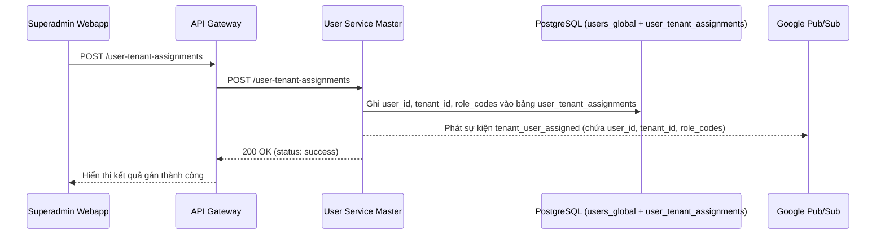
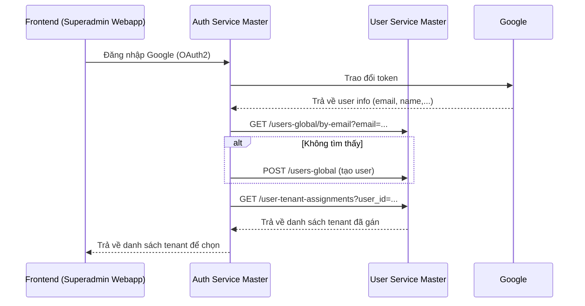
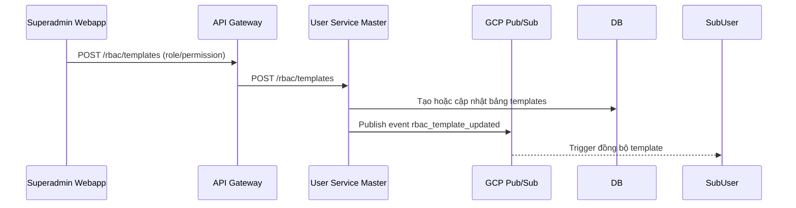
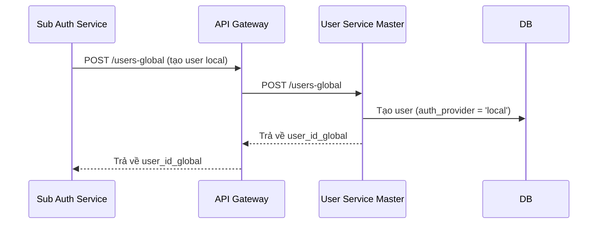

# 📘 User Service Master – Service Design Document

---

## 1. Mục đích (Scope)

User Service Master chịu trách nhiệm quản lý định danh người dùng toàn cục (`users_global`), danh sách tenant (`tenants`) và việc gán người dùng vào tenant cụ thể (`user_tenant_assignments`). Ngoài ra, service này cũng cung cấp các template RBAC toàn cục (`global_roles_templates`, `global_permissions_templates`) để các Sub User Service có thể đồng bộ và khởi tạo RBAC cục bộ cho từng tenant.

Service này là nền tảng cốt lõi cho toàn bộ hệ thống phân quyền đa tenant, đảm bảo tính nhất quán trong quản lý người dùng và hỗ trợ các luồng xác thực từ Auth Master/Sub.

### 🚫 Không chịu trách nhiệm (Out of Scope)

User Service Master **không** chịu trách nhiệm đối với các chức năng sau:

- ❌ Quản lý RBAC chi tiết ở cấp tenant (bao gồm roles, permissions, và user-role mapping cục bộ) – đây là trách nhiệm của Sub User Service tương ứng.
- ❌ Thực hiện xác thực người dùng (Google OAuth2, OTP, Local login) – do Auth Service Master/Sub xử lý.
- ❌ Lưu trữ hoặc xử lý các dữ liệu nghiệp vụ chi tiết của từng tenant (ví dụ: học sinh, giáo viên, lớp học, học phí...) – các adapter CRM/SIS/LMS đảm nhiệm phần này.
- ❌ Cung cấp các giao diện frontend – ví dụ Superadmin Webapp chỉ gọi API từ Gateway, chứ không truy cập trực tiếp vào service này.

---

## 2. Trách nhiệm chính (Responsibilities)

- Quản lý bảng định danh người dùng toàn hệ thống (`users_global`)
- Cho phép tạo, cập nhật, tra cứu thông tin người dùng toàn cục
- Quản lý danh sách tenant đang hoạt động và trạng thái
- Gán quyền người dùng vào các tenant cụ thể (`user_tenant_assignments`)
- Cung cấp bộ template `roles` và `permissions` dùng để seed xuống các tenant
- Phát sự kiện `user_created`, `tenant_user_assigned`, `rbac_template_updated` phục vụ Sub Services

---

## 3. Luồng nghiệp vụ chính (Business Flows)

### 🔹 Đăng nhập Google OAuth2 (qua Auth Master)
1. Auth Master xác thực thành công user Google → gọi `GET /users-global/by-email`
2. Nếu chưa tồn tại → gọi `POST /users-global` để tạo mới
3. Gọi `GET /user-tenant-assignments?user_id=...` để lấy danh sách tenant người dùng thuộc về
4. Người dùng chọn tenant → chuyển qua luồng Auth tiếp theo

### 🔹 Gán người dùng vào tenant
- Admin hệ thống (qua Superadmin Webapp) có thể gán người dùng vào 1 hoặc nhiều tenant
- Gọi `POST /user-tenant-assignments`
- Phát sự kiện `tenant_user_assigned` để Sub User Service tạo bản ghi cục bộ

#### 🔄 Luồng 1: Superadmin gán người dùng vào tenant



**📝 Giải thích chi tiết:**

1. Superadmin gửi yêu cầu gán người dùng (`user_id`) vào một `tenant_id`, kèm danh sách `role_codes`.
2. API Gateway định tuyến request tới User Service Master.
3. User Service Master ghi thông tin vào bảng `user_tenant_assignments`.
4. Sau khi ghi thành công, service phát một sự kiện `tenant_user_assigned` lên Pub/Sub, giúp Sub User Service của tenant tương ứng có thể đồng bộ RBAC.
5. Kết quả trả về cho frontend xác nhận hành động đã thành công.

**🔁 Trường hợp lỗi tiềm ẩn:**

* `user_id` không tồn tại trong `users_global` → 404.
* `tenant_id` không hợp lệ hoặc không tồn tại → 400.
* Lỗi logic: người dùng đã được gán vào tenant đó → 409 Conflict.

#### 🔐 Luồng 2: Đăng nhập Google OAuth2 – yêu cầu từ Auth Master



➡️ Sau bước này, AuthM sẽ tiếp tục gọi Sub User Service tương ứng để lấy RBAC và phát hành JWT.

---

#### 🧩 Luồng 3: Tạo/Cập nhật RBAC Template



➡️ Các Sub User Service có thể tự đồng bộ hoặc hiển thị gợi ý cập nhật template.

---

#### 👤 Luồng 4: Sub Auth Service tạo user local mới và cấp `user_id_global`



➡️ AuthT sau đó sẽ gán user vào tenant của mình và phát hành JWT theo chuẩn đa tenant.

---

## 4. Mô hình dữ liệu

Các bảng chính do User Service Master quản lý bao gồm:

- `users_global`: danh sách người dùng toàn cục, gắn với auth_provider.
- `tenants`: thông tin từng tenant (trường thành viên).
- `user_tenant_assignments`: liên kết người dùng với từng tenant cụ thể.
- `global_roles_templates`: danh sách template vai trò toàn cục.
- `global_permissions_templates`: danh sách template quyền toàn cục.

### 🧩 Sơ đồ ERD tổng quan

```mermaid
erDiagram
    USERS_GLOBAL {
        UUID user_id PK
        TEXT full_name
        TEXT email
        TEXT auth_provider
    }

    TENANTS {
        TEXT tenant_id PK
        TEXT tenant_name
        TEXT status
    }

    USER_TENANT_ASSIGNMENTS {
        UUID id PK
        UUID user_id_global FK
        TEXT tenant_id FK
        TEXT[] role_codes
        BOOLEAN is_active
    }

    GLOBAL_ROLES_TEMPLATES {
        UUID template_id PK
        TEXT template_code UNIQUE
        TEXT description
    }

    GLOBAL_PERMISSIONS_TEMPLATES {
        UUID template_id PK
        TEXT permission_code UNIQUE
        TEXT action
        TEXT resource
        JSONB default_condition
    }

    USERS_GLOBAL ||--o{ USER_TENANT_ASSIGNMENTS : has
    TENANTS ||--o{ USER_TENANT_ASSIGNMENTS : includes
    GLOBAL_ROLES_TEMPLATES ||--o{ GLOBAL_PERMISSIONS_TEMPLATES : defines
```

👉 Xem chi tiết định nghĩa bảng tại: [`data-model.md`](./data-model.md)

---

## 5. API

User Service Master cung cấp các API phục vụ cho:

- Superadmin Webapp: quản lý định danh người dùng và RBAC toàn cục.
- Auth Service Master/Sub: tra cứu, tạo người dùng toàn cục.
- Sub User Service: đồng bộ danh sách assignment, template RBAC.

Chi tiết định nghĩa tham khảo tại [`interface-contract.md`](./interface-contract.md) và [`openapi.yaml`](./openapi.yaml).

### 📚 Bảng tóm tắt API chính

| Method | Path                          | Mô tả ngắn                                      | Yêu cầu quyền                     |
|--------|-------------------------------|------------------------------------------------|----------------------------------|
| GET    | `/users-global/by-email`      | Tra cứu người dùng toàn cục theo email         | Authenticated (Google)           |
| POST   | `/users-global`               | Tạo người dùng toàn cục mới                    | Authenticated (Google, OTP)      |
| GET    | `/tenants`                    | Liệt kê danh sách các tenant hiện có           | Superadmin                       |
| GET    | `/user-tenant-assignments`    | Tra cứu các tenant mà người dùng thuộc về      | Auth Service / Admin Tenant     |
| POST   | `/user-tenant-assignments`    | Gán người dùng vào tenant cụ thể               | Superadmin                       |
| GET    | `/global-roles-templates`     | Tra cứu template vai trò toàn cục              | Superadmin                       |
| POST   | `/global-roles-templates`     | Tạo mới template vai trò toàn cục              | Superadmin                       |
| GET    | `/global-permissions-templates` | Tra cứu template quyền toàn cục               | Superadmin                       |
| POST   | `/global-permissions-templates` | Tạo mới template quyền toàn cục               | Superadmin                       |

---

## 6. Sự kiện phát ra (Events)

User Service Master phát các sự kiện lên Google Cloud Pub/Sub để:

- Thông báo cho các Sub User Services về thay đổi RBAC.
- Cho phép các service khác đồng bộ định danh người dùng và cấu hình tenant.

### 📢 Danh sách sự kiện

#### 1. `tenant_user_assigned`

> Khi một người dùng được gán vào một tenant mới.

```json
{
  "event_id": "evt_7a3a8b40",
  "event_type": "tenant_user_assigned",
  "user_id": "usr_12345678",
  "tenant_id": "vas-truong-a",
  "role_codes": ["teacher", "homeroom"],
  "is_active": true,
  "timestamp": "2025-06-01T08:30:00Z"
}
```

* **Consumer:** Sub User Service của tenant tương ứng
* **Tác dụng:** Tự động tạo `users_in_tenant` và mapping role cho user trong tenant đó
* **Yêu cầu idempotency:** Sub Service phải kiểm tra `event_id` hoặc `user_id + tenant_id` đã xử lý hay chưa.

---

#### 2. `rbac_template_updated`

> Khi một template vai trò hoặc quyền toàn cục được cập nhật.

```json
{
  "event_id": "evt_5baf6c2d",
  "event_type": "rbac_template_updated",
  "template_type": "permission",
  "template_id": "perm_tpl_001",
  "action": "create_or_update",
  "updated_by": "superadmin@vas.edu.vn",
  "timestamp": "2025-06-01T09:00:00Z"
}
```

* **Consumer:** Sub User Services có nhu cầu đồng bộ template
* **Tác dụng:** Cho phép Sub Service quyết định có nên cập nhật local template không (hoặc gợi ý cho admin cập nhật thủ công)
* **Gợi ý thực thi:** Có thể lưu lại trong bảng `rbac_template_sync_log` tại Sub Service để kiểm soát phiên bản.

---

## 7. Bảo mật & phân quyền

- Các API cần xác thực nội bộ (`Auth Master`, `Admin Webapp`)
- Chỉ user có `superadmin` hoặc token kỹ thuật mới được gọi `POST /user-tenant-assignments`
- Ghi log audit cho mọi thay đổi định danh người dùng

---

## 8. Cấu hình & Triển khai

### 🔧 Biến môi trường quan trọng

| Biến Môi Trường                | Mô tả                                                                 | Ví dụ Giá trị                            |
|-------------------------------|----------------------------------------------------------------------|------------------------------------------|
| `ENV`                         | Môi trường triển khai (`local`, `staging`, `production`)             | `production`                             |
| `PORT`                        | Cổng dịch vụ                                                          | `8080`                                   |
| `DATABASE_URL`                | Kết nối tới PostgreSQL chứa dữ liệu người dùng toàn cục              | `postgresql+asyncpg://...`               |
| `PUBSUB_PROJECT_ID`           | GCP Project ID để phát sự kiện                                       | `vas-dx-core`                            |
| `PUBSUB_TOPIC_RBAC_TEMPLATE` | Tên topic Pub/Sub để phát `rbac_template_updated`                    | `vas-rbac-template-updated-topic`        |
| `PUBSUB_TOPIC_TENANT_ASSIGN` | Tên topic Pub/Sub để phát `tenant_user_assigned`                     | `vas-tenant-user-assignment-topic`       |
| `SERVICE_AUTH_TOKEN`          | Token nội bộ dùng để xác thực giữa các service (JWT hoặc static key) | `secret_token_xyz`                       |

### 🔐 Secrets cần quản lý riêng

| Secret                        | Mô tả                                                                 |
|------------------------------|----------------------------------------------------------------------|
| `DATABASE_PASSWORD`          | Mật khẩu truy cập cơ sở dữ liệu                                       |
| `JWT_PRIVATE_KEY_PATH`       | Đường dẫn tới private key dùng để ký JWT (nếu phát hành tại đây)     |
| `RBAC_CACHE_REDIS_URL`       | Đường dẫn kết nối tới Redis chứa cache RBAC                          |

> 🔐 Các secrets nên được quản lý thông qua Google Secret Manager hoặc HashiCorp Vault tùy vào chiến lược DevOps của toàn hệ thống.

---

## 9. Chiến lược Test

### 🧪 Các lớp kiểm thử

| Loại Test        | Mục tiêu chính                                                         |
|------------------|------------------------------------------------------------------------|
| Unit Test        | Kiểm tra logic xử lý đơn vị (ví dụ: xử lý RBAC template, validate input) |
| Integration Test | Kiểm tra tương tác giữa API, database, Pub/Sub                        |
| E2E Test (gián tiếp) | Kiểm tra tích hợp qua luồng nghiệp vụ từ Superadmin Webapp hoặc Auth Master |
| Contract Test    | Kiểm tra tính tương thích OpenAPI với client (Auth, Sub Service...)   |

### 📑 Kịch bản kiểm thử quan trọng

#### ✅ Kiểm thử chức năng quản lý user global
- Tạo user toàn cục mới với `auth_provider = google`
- Lookup user theo `email`
- Không cho phép trùng `email + auth_provider`

#### ✅ Kiểm thử phân bổ người dùng vào tenant
- Tạo assignment mới (POST `/user-tenant-assignments`)
- Không cho phép gán cùng user_id + tenant_id 2 lần
- Kiểm tra sự kiện `tenant_user_assigned` đã được phát lên Pub/Sub

#### ✅ Kiểm thử quản lý RBAC template toàn cục
- Tạo, sửa, xóa template role & permission
- Ghi nhận sự kiện `rbac_template_updated` phát đúng format
- Kiểm tra tính nhất quán nếu nhiều request song song

### 🧰 Công cụ sử dụng

- `pytest`, `httpx`, `asyncpg` – cho unit/integration test
- Mock GCP Pub/Sub bằng emulator hoặc test double
- Redis test container để kiểm tra cache logic nếu có

### 🧪 Dữ liệu test mẫu

```json
{
  "full_name": "Nguyen Van A",
  "email": "vana@example.com",
  "auth_provider": "google"
}
```

> 🧠 Mọi kịch bản test cần bao gồm trường hợp thành công, lỗi logic, và lỗi hệ thống (timeout, lỗi DB, lỗi Pub/Sub...).

---

## 10. Tài liệu liên quan

| Tên tài liệu                                | Mô tả ngắn gọn                                                                 |
|---------------------------------------------|--------------------------------------------------------------------------------|
| [rbac-deep-dive.md](../../../rbac-deep-dive.md) | Mô tả chi tiết kiến trúc RBAC, các bảng liên quan và sơ đồ quyền              |
| [adr-007-rbac.md](../../../adr-007-rbac.md)     | Quyết định thiết kế kiến trúc RBAC phân tầng theo mô hình Master-Sub          |
| [adr-006-auth-strategy.md](../../../adr-006-auth-strategy.md) | Mô tả chiến lược xác thực, JWT và vai trò của User Service Master/Sub         |
| [data-model.md](./data-model.md)             | Chi tiết các bảng CSDL được quản lý bởi User Service Master                  |
| [interface-contract.md](./interface-contract.md) | Hợp đồng API định nghĩa rõ input/output, auth, mã lỗi của các endpoint       |
| [openapi.yaml](./openapi.yaml)               | File đặc tả OpenAPI kỹ thuật dùng để tạo SDK/Client/Docs tự động             |
| [system-diagrams.md](../../../system-diagrams.md) | Sơ đồ kiến trúc tổng thể hệ thống, các service và dòng tương tác             |
| [README.md](../../../README.md)              | Tài liệu kiến trúc tổng quan, mục tiêu tổng thể và các nguyên lý thiết kế     |
