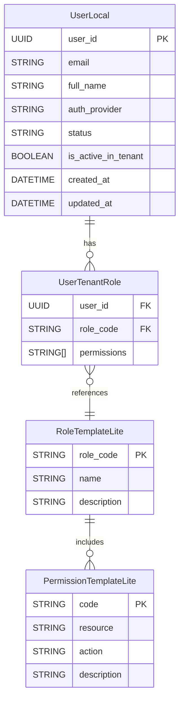

# 🗃️ Data Model – Sub User Service

```
title: Data Model – User Service Sub
version: 1.1
last_updated: 2025-06-01
author: DX VAS Team
reviewed_by: Stephen Le
```

## 📘 Giới thiệu

`user-service/sub/` là một service chỉ đọc (read-only) theo kiến trúc master/sub. Service này quản lý dữ liệu người dùng trong phạm vi một tenant cụ thể. Dữ liệu được đồng bộ một chiều từ `user-service/master` thông qua các sự kiện Pub/Sub, không cho phép ghi trực tiếp từ phía client.

Tài liệu này mô tả toàn bộ mô hình dữ liệu nội bộ của Sub Service, bao gồm các bảng: `UserLocal`, `UserTenantRole`, `RoleTemplateLite`, và `PermissionTemplateLite`.  
Dữ liệu này không bao gồm thông tin xác thực (auth), cũng không quản lý RBAC template gốc (chỉ giữ bản sao).

---

## 1. Sơ đồ ERD (Entity Relationship Diagram)



> 💡 **Ghi chú:**
> Mối quan hệ `RoleTemplateLite → PermissionTemplateLite` là **logic**, thể hiện việc một role "bao gồm" các permissions. RBACResolver sẽ tự động "expand" quyền dựa trên cache template – không có bảng join vật lý giữa 2 bảng này.

---

## 2. Chi tiết Bảng

### 📌 `UserLocal`

> Bảng này chứa thông tin người dùng nội bộ đã được đồng bộ từ Master. Dùng để truy xuất dữ liệu user và trạng thái kích hoạt trong tenant hiện tại.

| Tên cột               | Kiểu     | Ràng buộc     | Mô tả                                                      |
| --------------------- | -------- | ------------- | ---------------------------------------------------------- |
| `user_id`             | UUID     | PK            | ID người dùng nội bộ, mirror từ Master                     |
| `email`               | string   | NOT NULL      | Email của người dùng                                       |
| `full_name`           | string   |               | Họ tên đầy đủ                                              |
| `auth_provider`       | enum     | NOT NULL      | `local` hoặc `google`                                      |
| `status`              | enum     | NOT NULL      | `active`, `suspended`, `invited`, `deleted`, mirror từ UserGlobal |
| `is_active_in_tenant` | boolean  | NOT NULL      | Trạng thái assignment còn hiệu lực trong tenant            |
| `created_at`          | datetime | DEFAULT NOW() | Ngày tạo bản ghi                                           |
| `updated_at`          | datetime |               | Ngày cập nhật gần nhất                                     |

```sql
CREATE TABLE user_local (
  user_id UUID PRIMARY KEY,
  email VARCHAR(255) NOT NULL,
  full_name VARCHAR(255),
  auth_provider VARCHAR(32) NOT NULL,
  status VARCHAR(32) NOT NULL,
  is_active_in_tenant BOOLEAN NOT NULL DEFAULT TRUE,
  created_at TIMESTAMPTZ DEFAULT now(),
  updated_at TIMESTAMPTZ
);
```

---

### 📌 `UserTenantRole`

> Liên kết người dùng với các role trong tenant, dùng để expand quyền của user trong RBACResolver.

| Tên cột       | Kiểu      | Ràng buộc                         | Mô tả                                               |
| ------------- | --------- | --------------------------------- | --------------------------------------------------- |
| `user_id`     | UUID      | FK → `UserLocal.user_id`          | Người dùng được gán                                 |
| `role_code`   | string    | FK → `RoleTemplateLite.role_code` | Mã role được gán                                    |
| `permissions` | string\[] |                                   | Danh sách quyền mở rộng từ role\_code (cache local) |

```sql
CREATE TABLE user_tenant_role (
  user_id UUID REFERENCES user_local(user_id) ON DELETE CASCADE,
  role_code VARCHAR(64) REFERENCES role_template_lite(role_code),
  permissions TEXT[],
  PRIMARY KEY (user_id, role_code)
);
```

---

### 📌 `RoleTemplateLite`

> Bản sao role template đã đồng bộ từ Master. Không chỉnh sửa tại Sub.

| Tên cột       | Kiểu   | Ràng buộc | Mô tả                                       |
| ------------- | ------ | --------- | ------------------------------------------- |
| `role_code`   | string | PK        | Mã định danh role (duy nhất trong hệ thống) |
| `name`        | string |           | Tên hiển thị của role                       |
| `description` | string |           | Mô tả chi tiết role                         |

```sql
CREATE TABLE role_template_lite (
  role_code VARCHAR(64) PRIMARY KEY,
  name VARCHAR(255),
  description TEXT
);
```

---

### 📌 `PermissionTemplateLite`

> Danh sách các quyền có thể sử dụng tại tenant, được đồng bộ từ Master.

| Tên cột       | Kiểu   | Ràng buộc | Mô tả                                           |
| ------------- | ------ | --------- | ----------------------------------------------- |
| `code`        | string | PK        | Mã permission                                   |
| `resource`    | string |           | Tài nguyên áp dụng (VD: `student`, `gradebook`) |
| `action`      | string |           | Hành động được phép (VD: `view`, `edit`)        |
| `description` | string |           | Mô tả quyền này cho mục đích UI/Admin           |

```sql
CREATE TABLE permission_template_lite (
  code VARCHAR(128) PRIMARY KEY,
  resource VARCHAR(64),
  action VARCHAR(64),
  description TEXT
);
```

---

## 3. Ràng buộc, Chỉ mục & Hành vi Cascade

### 🔐 Ràng buộc & Hành vi Cascade

* `UserTenantRole.user_id` có `ON DELETE CASCADE` → nếu user bị purge, các vai trò sẽ tự động bị xóa.
* `UserTenantRole.role_code` dùng `ON DELETE RESTRICT` → tránh lỗi do mất role đồng bộ.
* Không có bảng join giữa role và permission – mapping logic nằm trong memory (RBACResolver cache).

### 📌 Chỉ mục (Indexes)

| Bảng             | Cột được index    | Loại index      | Ghi chú                                                |
|------------------|-------------------|------------------|---------------------------------------------------------|
| `UserLocal`      | `user_id`         | PK (UUID)        | Lookup chính                                           |
| `UserTenantRole` | `(user_id, role_code)` | Composite PK | Truy vấn theo cặp user-role                           |
| `UserTenantRole` | `user_id`         | Index            | Giúp truy vấn nhanh vai trò của một user               |
| `RoleTemplateLite` | `role_code`     | PK               | Lookup duy nhất theo mã role                          |
| `PermissionTemplateLite` | `code`    | PK               | Lookup duy nhất theo mã permission                    |

> 💡 Các bảng template là dữ liệu tĩnh chỉ đọc, thường không cần index bổ sung ngoài khóa chính.

---

## 4. Enum sử dụng

### `auth_provider`

* `local`
* `google`

### `status`

* `active`
* `invited`
* `suspended`
* `deleted`

---

## 5. Tuân thủ ADR & Chính sách

| ADR                                                             | Mô tả liên quan                          |
| --------------------------------------------------------------- | ---------------------------------------- |
| [ADR-024](../../../ADR/adr-024-data-anonymization-retention.md) | TTL dữ liệu nếu user không còn hoạt động |
| [ADR-026](../../../ADR/adr-026-hard-delete-policy.md)           | Quy tắc xử lý `purge` user               |
| [ADR-027](../../../ADR/adr-027-data-management-strategy.md)     | Phân quyền đọc/ghi theo master/sub       |
| [ADR-023](../../../ADR/adr-023-schema-migration-strategy.md)    | Chiến lược migration schema              |

---

## 6. Liên kết tài liệu

* [Design Document](./design.md)
* [Interface Contract](./interface-contract.md)
* [OpenAPI Spec](./openapi.yaml)
