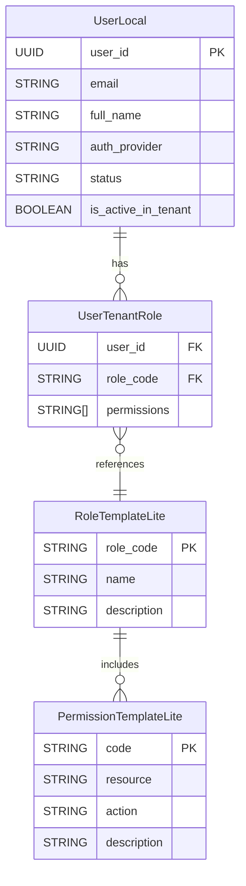
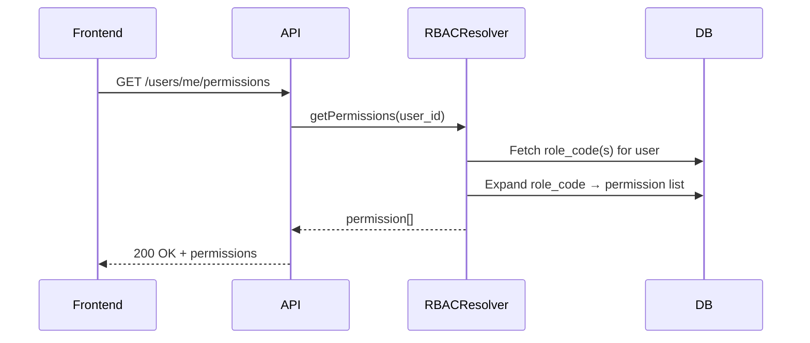

# 📘 User Service Sub – Service Design Document

```
title: Thiết kế chi tiết User Service Sub
version: 1.1
last_updated: 2025-05-31
author: DX VAS Team
reviewed_by: Stephen Le
```

## 1. 🧭 Phạm vi và Trách nhiệm (Scope & Responsibilities)

### 🎯 Mục tiêu
- Cung cấp dữ liệu người dùng nội bộ cho frontend trong từng tenant.
- Không thực hiện bất kỳ hành động ghi nào vào dữ liệu người dùng.
- Toàn bộ dữ liệu được đồng bộ từ `user-service/master` thông qua cơ chế event-driven.

### 📦 Các thực thể dữ liệu quản lý
| Thực thể              | Mô tả                                                                 |
|-----------------------|----------------------------------------------------------------------|
| `UserLocal`           | Bản sao của `UserGlobal`, lưu trạng thái người dùng trong tenant     |
| `UserTenantRole`      | Vai trò mà người dùng được gán trong tenant                         |
| `RoleTemplateLite`    | Danh sách role được đồng bộ từ master                                |
| `PermissionTemplateLite` | Danh sách quyền được đồng bộ từ master                           |

### 🔒 Ngoài Phạm Vi (Out of Scope)

Service này **không** thực hiện các tác vụ sau:

- ❌ Xác thực (authentication): việc xác thực JWT đã được thực hiện tại Gateway.
- ❌ Quản lý vòng đời RBAC template (tạo/sửa/xoá role/permission template): Sub chỉ consume bản sao đã đồng bộ.
- ❌ Ghi dữ liệu người dùng: không tạo/sửa/xoá người dùng hoặc role trực tiếp – chỉ nhận qua event.
- ❌ Truy cập hoặc xử lý dữ liệu ngoài phạm vi tenant được gán (đảm bảo cách ly tenant tuyệt đối).
- ❌ Gọi sang `user-service/master` hoặc các service khác: không có external HTTP call.

---

## 2. 🌐 Thiết kế API chi tiết (Interface Contract)

| Method | Path                     | Tác vụ                        | Yêu cầu permission             |
|--------|--------------------------|-------------------------------|-------------------------------|
| GET    | `/users`                 | Danh sách user trong tenant   | ✅ `tenant.read_users`         |
| GET    | `/users/me`              | Thông tin người dùng hiện tại | ❌                             |
| GET    | `/users/me/permissions`  | Danh sách quyền của user      | ❌                             |
| GET    | `/roles`                 | Role template hiện có         | ✅ `tenant.view_rbac_config`   |
| GET    | `/permissions`           | Permission template hiện có   | ✅ `tenant.view_rbac_config`   |

> 🔧 API dùng chuẩn OpenAPI, tuân thủ cấu trúc response ADR-012, định nghĩa schema riêng cho tất cả response và error.

### 📦 Ví dụ response `GET /users/me/permissions`
```json
{
  "data": [
    "student.view",
    "attendance.mark"
  ],
  "meta": {
    "request_id": "req-abc-123",
    "timestamp": "2025-05-31T14:20:00Z"
  }
}
```

---

## 3. 🗃️ Mô hình dữ liệu chi tiết (Data Model)

### 🗺️ Sơ đồ ERD (Entity Relationship Diagram)


> 💡 **Ghi chú:** Mối quan hệ RoleTemplateLite → PermissionTemplateLite là mối quan hệ logic, không được biểu diễn qua bảng join vật lý. RBACResolver tại Sub sẽ tự động "expand" permissions dựa trên bản cache template từ Master.

### Bảng: `UserLocal`
| Cột                 | Kiểu     | Ghi chú                                |
|---------------------|----------|----------------------------------------|
| `user_id`           | UUID     | Primary key                            |
| `email`             | string   |                                        |
| `full_name`         | string   |                                        |
| `auth_provider`     | enum     | [local, google]                        |
| `status`            | enum     | Mirror từ UserGlobal                   |
| `is_active_in_tenant` | boolean | Tính từ `assignment_status` & `status`|
| `created_at`        | datetime |                                        |
| `updated_at`        | datetime |                                        |

### Bảng: `UserTenantRole`
| Cột           | Kiểu     | Ghi chú                         |
|---------------|----------|---------------------------------|
| `user_id`     | UUID     |                                 |
| `role_code`   | string   |                                 |
| `permissions` | string[] | Expand từ `role_code`           |

### Bảng: `RoleTemplateLite`
| `role_code`   | string | Primary key |
| `name`        | string |             |
| `description` | string |             |

### Bảng: `PermissionTemplateLite`
| `code`        | string | Primary key |
| `resource`    | string |             |
| `action`      | string |             |
| `description` | string |             |

---

## 4. 🔄 Luồng xử lý nghiệp vụ chính (Business Logic Flows)

### `GET /users/me/permissions`


---

## 5. 📣 Các sự kiện Pub/Sub

| Sự kiện nhận                        | Hành động tại Sub Service                                             |
| ----------------------------------- | --------------------------------------------------------------------- |
| `user_global_created`               | Insert `UserLocal`                                                    |
| `user_updated`                      | Update `UserLocal`                                                    |
| `user_assigned_to_tenant`           | Insert/Update `UserTenantRole`, đánh dấu `is_active_in_tenant = true` |
| `user_removed_from_tenant`          | Cập nhật `is_active_in_tenant = false`                                |
| `purge_user_from_tenant` (tuỳ chọn) | Xoá vật lý `UserLocal` nếu chính sách cho phép                        |
| `rbac_template_updated`             | Cập nhật bảng `RoleTemplateLite`, `PermissionTemplateLite`            |

### 📦 Ví dụ Payload Sự Kiện Tiêu Biểu (Event Payloads)

```json
// user_assigned_to_tenant
{
  "event": "user_assigned_to_tenant",
  "user_id": "uuid-1234",
  "tenant_id": "tenant-abc",
  "role_code": "teacher",
  "assigned_by": "admin-user-999",
  "assigned_at": "2025-05-01T10:00:00Z"
}
```

```json
// rbac_template_updated
{
  "event": "rbac_template_updated",
  "role_code": "teacher",
  "permissions": [
    { "code": "student.view", "resource": "student", "action": "view" },
    { "code": "attendance.mark", "resource": "attendance", "action": "update" }
  ],
  "updated_at": "2025-05-01T09:30:00Z"
}
```

---

## 6. 🔐 Bảo mật & Phân quyền

* Auth: sử dụng JWT token cấp tenant.
* Các API `/users`, `/roles`, `/permissions` **khai báo `x-required-permission` rõ ràng**, nhưng không tự kiểm tra.
* Việc thực thi (`enforce`) quyền sẽ do **API Gateway đảm nhiệm** dựa trên JWT và RBAC cache.
* Các API `/me`, `/me/permissions` chỉ cần token hợp lệ, không cần thêm permission.

---

## 7. ⚙️ Cấu hình & Phụ thuộc (Dependencies)

| Thành phần         | Mục đích                            |
| ------------------ | ----------------------------------- |
| `PG_HOST`, `PG_DB` | Kết nối database                    |
| `KAFKA_BROKER`     | Lắng nghe sự kiện từ Master         |
| `TENANT_ID`        | Gán cứng trong mỗi instance của Sub |
| `JWT_SECRET`       | Xác thực token                      |

> Sub-service này **không gọi trực tiếp service khác**, chỉ consume event.

---

## 8. 🧪 Testing

### 🔹 Unit Test

* RBACResolver.expand()
* Mappers & converters DB → API response
* Schema validator cho OpenAPI

### 🔹 Integration Test

* Simulate event từ Master → assert DB update
* Test endpoint `/me/permissions` trả về chính xác với nhiều role

> 🧪 Có thể sử dụng tools như `pytest`, `testcontainers`, hoặc `async-kafka` mock để kiểm tra event flow

---

## 9. 📈 Khả năng Giám sát (Observability)

| Metric                                  | Mô tả                                                  |
| --------------------------------------- | ------------------------------------------------------ |
| `sub_user_sync_total`                   | Tổng số user được đồng bộ từ master                    |
| `sub_event_consume_latency`             | Độ trễ trung bình khi xử lý 1 event                    |
| `sub_event_error_count`                 | Số lượng lỗi khi xử lý event (có thể chia theo type)   |
| `api_get_users_latency`                 | Thời gian xử lý `GET /users` trung bình                |
| `api_get_me_permissions_cache_hit_rate` | Tỷ lệ cache hit nếu sử dụng Redis cho permission cache |

> Nên expose các metric này qua Prometheus nếu có setup observability chung.

---

## 10. 🔁 Độ tin cậy & Phục hồi (Reliability & Resilience)

* **Cơ chế retry event**: Tối thiểu 3 lần nếu event xử lý thất bại, sau đó ghi vào Dead Letter Queue (DLQ).
* **Idempotency key**: Dựa trên `user_id + tenant_id + event_type`, đảm bảo việc consume event không gây trùng lặp dữ liệu.
* **Theo dõi offset Kafka**: Đảm bảo event không bị mất hoặc xử lý trễ.

---

## 11. ⚡️ Hiệu năng & Khả năng mở rộng

* **SLO đề xuất:**

  * `GET /users`: <150ms với tenant ≤ 1000 người dùng
  * `GET /users/me/permissions`: <100ms (cacheable)
* **Scalability:** sub-service có thể scale horizontally, mỗi instance gắn với 1 tenant.
* **Caching (tùy chọn):** `GET /users/me/permissions` có thể được cache theo session.

---

## 12. 📚 Tài liệu liên kết

* [Interface Contract](./interface-contract.md): Đặc tả chi tiết các API được service cung cấp
* [Data Model](./data-model.md): Thiết kế schema CSDL chi tiết cho service
* [OpenAPI](./openapi.yaml): Mô tả chuẩn OpenAPI 3.1 cho các endpoint
* [adr-012 - Response Structure](../../../ADR/adr-012-response-structure.md): Chuẩn định dạng API response toàn hệ thống
* [adr-026 - Hard Delete Policy](../../../ADR/adr-026-hard-delete-policy.md): Chính sách xóa cứng dữ liệu
* [adr-027 - Data Management Strategy](../../../ADR/adr-027-data-management-strategy.md): Chiến lược quản lý dữ liệu giữa Master/Sub 
