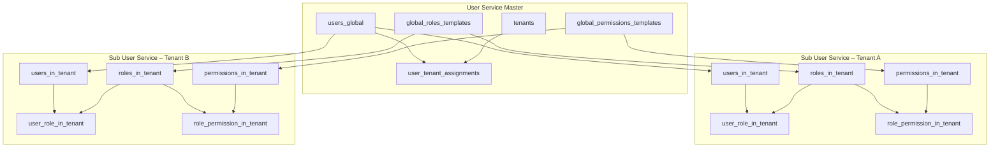
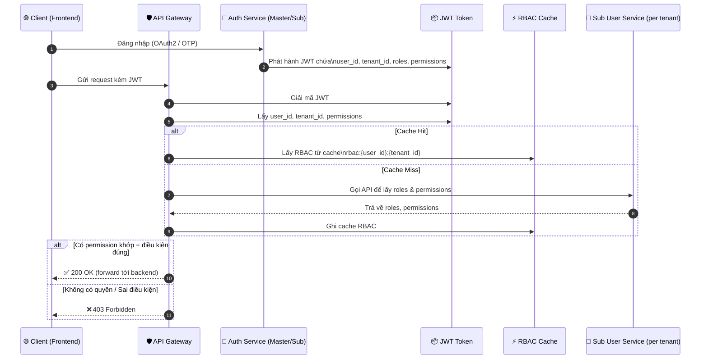

# Phân tích Chuyên sâu: Kiến trúc Phân quyền Động (RBAC) trong Hệ thống dx-vas

## 1. Tổng quan & Định nghĩa RBAC

RBAC (Role-Based Access Control) trong hệ thống dx-vas cho phép kiểm soát quyền truy cập một cách linh hoạt và có thể mở rộng, dựa trên:

- **Vai trò người dùng** (Role) trong từng trường thành viên (tenant)
- **Tập hợp quyền** (Permission) được gán cho mỗi role
- **Điều kiện thực thi** (Condition, nếu có) áp dụng ở cấp permission

Mô hình RBAC này hoạt động trong bối cảnh **multi-tenant**, nơi mỗi tenant (trường thành viên) có **RBAC độc lập**, nhưng vẫn kế thừa một phần từ **template toàn hệ thống** do User Service Master cung cấp.

---

## 2. Phân tầng Quản lý Định danh & Phân quyền

### 🧠 User Service Master
- Là nguồn chân lý duy nhất cho toàn bộ người dùng (`users_global`)
- Quản lý:
  - Danh sách tenant (`tenants`)
  - Mối quan hệ user ↔ tenant (`user_tenant_assignments`)
  - Các template vai trò và quyền toàn hệ thống:
    - `global_roles_templates`
    - `global_permissions_templates`
- Không trực tiếp đánh giá RBAC, mà cung cấp định danh và template cho Sub Services

### 🧩 Sub User Service (per Tenant)
- Mỗi tenant có 1 instance riêng, quản lý:
  - Người dùng thuộc tenant (`users_in_tenant`) – ánh xạ đến `user_id_global`
  - Trạng thái hoạt động nội bộ: `is_active_in_tenant`
  - Vai trò (`roles_in_tenant`), quyền (`permissions_in_tenant`)
  - Mapping:
    - `user_role_in_tenant`
    - `role_permission_in_tenant`
- Cho phép kế thừa từ template Master hoặc tự định nghĩa

---

## 3. Luồng Xác thực & Phân quyền (Multi-Tenant)

### 🔐 Luồng phát hành JWT
1. Người dùng đăng nhập qua:
   - Google OAuth2 → Auth Master
   - OTP/Local → Sub Auth Service
2. Sau khi xác thực:
   - `tenant_id` được chọn (nếu người dùng thuộc nhiều tenant)
   - Auth Service gọi User Service Master → kiểm tra `user_id_global` + quyền truy cập tenant
   - Gọi Sub User Service → lấy `roles`, `permissions`
3. JWT được phát hành với:
   - `user_id`, `tenant_id`, `roles`, `permissions`, `auth_provider`

### 🛡️ API Gateway đánh giá RBAC
- Trích xuất `tenant_id` từ JWT
- Kiểm tra `is_active` + `is_active_in_tenant`
- Truy vấn Redis cache: `rbac:{user_id}:{tenant_id}`
- Nếu không có cache, gọi Sub User Service để load lại RBAC
- Đánh giá `condition` nếu permission có ràng buộc động

---

## 4. Mô hình Dữ liệu RBAC (Master vs Sub)

### 📦 Tại User Service Master

```sql
-- Danh sách người dùng toàn hệ thống
CREATE TABLE users_global (
  user_id UUID PRIMARY KEY,
  full_name TEXT,
  email TEXT,
  phone TEXT,
  auth_provider TEXT CHECK (auth_provider IN ('google', 'local')),
  local_auth_tenant_id UUID NULL,
  is_active BOOLEAN DEFAULT TRUE
);

-- Danh sách tenant
CREATE TABLE tenants (
  tenant_id UUID PRIMARY KEY,
  tenant_name TEXT,
  status TEXT CHECK (status IN ('active', 'inactive'))
);

-- Gán user vào tenant
CREATE TABLE user_tenant_assignments (
  user_id UUID REFERENCES users_global(user_id),
  tenant_id UUID REFERENCES tenants(tenant_id),
  assigned_by UUID,
  assigned_at TIMESTAMP,
  PRIMARY KEY (user_id, tenant_id)
);

-- Template vai trò và quyền toàn hệ thống
CREATE TABLE global_roles_templates (...);
CREATE TABLE global_permissions_templates (...);
```

### 📦 Tại Sub User Service (mỗi tenant)

```sql
-- Người dùng nội bộ tenant (tham chiếu user toàn cục)
CREATE TABLE users_in_tenant (
  user_id UUID PRIMARY KEY,
  user_id_global UUID REFERENCES users_global(user_id),
  is_active_in_tenant BOOLEAN DEFAULT TRUE
);

-- Vai trò và quyền của tenant
CREATE TABLE roles_in_tenant (
  role_id UUID PRIMARY KEY,
  role_code TEXT UNIQUE,
  role_name TEXT
);

CREATE TABLE permissions_in_tenant (
  permission_id UUID PRIMARY KEY,
  permission_code TEXT UNIQUE,
  action TEXT,
  resource TEXT,
  condition JSONB -- chứa ràng buộc như { "class_id": "$user.class_id" }
);

-- Mapping vai trò ↔ người dùng
CREATE TABLE user_role_in_tenant (
  user_id UUID REFERENCES users_in_tenant(user_id),
  role_id UUID REFERENCES roles_in_tenant(role_id),
  PRIMARY KEY (user_id, role_id)
);

-- Mapping quyền ↔ vai trò
CREATE TABLE role_permission_in_tenant (
  role_id UUID REFERENCES roles_in_tenant(role_id),
  permission_id UUID REFERENCES permissions_in_tenant(permission_id),
  PRIMARY KEY (role_id, permission_id)
);
```

📘 Toàn bộ mô hình dữ liệu đầy đủ được định nghĩa trong:

* [`user-service/master/data-model.md`](../services/user-service/master/data-model.md)
* [`user-service/tenant/data-model.md`](../services/user-service/tenant/data-model.md)

---

## 5. Permission có điều kiện (Condition JSONB)

Hệ thống dx-vas hỗ trợ **permission có điều kiện** – cho phép kiểm soát truy cập động dựa trên ngữ cảnh request và đặc tính của người dùng. Mỗi permission có thể khai báo một `condition` dưới dạng JSONB.

### 📌 Ví dụ về permission có điều kiện:

```json
{
  "class_id": "$user.class_id"
}
```

Ý nghĩa: Chỉ cho phép truy cập khi `class_id` trong request **trùng khớp với** `class_id` của user hiện tại (do Sub User Service cung cấp trong JWT).

### 🛠 Context hỗ trợ khi evaluate:

* **User context**: `$user.{field}` – đến từ `users_in_tenant`
* **Request context**: `$request.{field}` – từ body/query/header
* **Tenant context**: `$tenant.{field}` – nếu có metadata

### 🧠 Đánh giá điều kiện:

* Được thực hiện tại **API Gateway**
* Engine so sánh giá trị thực tế trong request với điều kiện JSONB
* Nếu một permission có `condition = null` → luôn đúng

📘 Các tenant có thể tự định nghĩa điều kiện riêng theo logic đặc thù.

---

## 6. Chiến lược Cache RBAC tại API Gateway

Để giảm tải truy vấn RBAC thường xuyên, hệ thống sử dụng cache RBAC tại API Gateway với chiến lược sau:

### 🔑 Key cache:

```text
rbac:{user_id}:{tenant_id}
```

### 📦 Value cache:

```json
{
  "roles": [...],
  "permissions": [...],
  "issued_at": "2025-07-01T12:00:00Z"
}
```

### ⏱ TTL & Làm mới:

* TTL mặc định: 5–15 phút tùy dịch vụ
* Có thể làm mới thủ công khi gán quyền mới
* Cache sẽ tự động làm mới nếu JWT mới chứa RBAC mới

### 🔁 Invalidation qua Pub/Sub:

* Khi Sub User Service cập nhật RBAC:

  * Phát sự kiện `rbac_updated` → Gateway subscribe → xoá cache
* Khi user bị vô hiệu hóa:

  * Phát sự kiện `user_status_changed` (từ Master hoặc Sub) → Gateway huỷ JWT và cache

📘 Định nghĩa event schema trong [`rbac-events.md`](./rbac-events.md)

---

## 7. Chiến lược Đồng bộ RBAC

Hệ thống hỗ trợ khả năng **kế thừa template từ Master**, **tuỳ chỉnh**, và **giao diện quản lý phân quyền riêng cho từng tenant**.

### 📚 Kế thừa & tùy chỉnh:

* Mỗi tenant có thể:

  * Dùng `global_roles_templates` & `global_permissions_templates` từ Master
  * Clone về làm bản riêng → đổi tên/logic/condition
  * Hoặc tự tạo từ đầu hoàn toàn

### 🧩 Gán role cho người dùng:

* Sub User Service cung cấp API cho Admin Webapp tenant:

  * Gán `role_id` cho `user_id`
  * Cập nhật `is_active_in_tenant`
  * Tạo vai trò tùy chỉnh (nếu được cấp quyền)

### 🔁 Đồng bộ định kỳ (tùy chọn):

* Nếu tenant cho phép, có thể đồng bộ lại template mỗi tuần/tháng từ Master

---

## 8. Hiệu năng & Khả năng mở rộng

Hệ thống RBAC của dx-vas được thiết kế để hỗ trợ **số lượng lớn tenant**, mỗi tenant có thể có hàng trăm vai trò và người dùng.

### 🔧 Kỹ thuật tối ưu:

* **Cache tại Gateway** → tránh truy vấn Sub Service mỗi request
* **Fan-out pub/sub invalidate** → tối thiểu hoá latency cập nhật RBAC
* **Permission condition JSONB** cho phép RBAC mềm dẻo mà không cần phân mảnh bảng

### ☁️ Cloud Scale:

* Redis RBAC cache được chia namespace theo `tenant_id`
* Sub User Service được autoscale độc lập → phân tải dễ dàng
* RBAC API có thể batch (gán nhiều role/user cùng lúc)

### 🔍 Monitoring:

* Mỗi lần cache hit/miss được log kèm `tenant_id`
* Có cảnh báo nếu role mapping bất thường (VD: user có 100+ role)

📘 Để tối ưu hơn nữa, có thể tích hợp JWT RBAC claims ký cứng với TTL ngắn + checksum (đang được nghiên cứu)

---

## 9. Bảo mật chuyên sâu trong RBAC

RBAC là lớp kiểm soát truy cập trọng yếu, nên các nguyên tắc bảo mật sau được áp dụng nghiêm ngặt trong hệ thống dx-vas:

### 🔐 Isolation theo Tenant
- Mỗi Sub User Service chỉ truy xuất dữ liệu người dùng và role/permission của chính tenant đó
- Không có API cho phép thao tác chéo tenant

### 🔐 Tên định danh và không gian RBAC
- Các vai trò (`role_code`) và quyền (`permission_code`) phải là duy nhất **trong phạm vi tenant**
- Không cho phép “shadow” vai trò từ tenant khác

### 🔐 Chống giả mạo JWT
- RBAC trong JWT phải được ký và xác thực bởi Gateway
- Không tin tưởng RBAC trong request từ client frontend

### 🔐 API RBAC luôn bảo vệ bởi Auth + Role
- Mọi thao tác gán quyền, gán vai trò, cập nhật phải có quyền cụ thể (`manage_rbac`, `assign_role`, v.v.)

---

## 10. Giám sát & Gỡ lỗi

Để hỗ trợ vận hành và bảo mật, các hành động liên quan đến RBAC được log và theo dõi chi tiết:

### 🪵 Audit Trail
- Mỗi hành động:
  - Gán vai trò
  - Tạo permission
  - Cập nhật condition
- Được log kèm:
  - `user_id`, `actor_id`, `tenant_id`, `timestamp`, `payload_before`, `payload_after`

### 🧪 Debug Flow tại Gateway
- Gắn `X-RBAC-Trace-ID` vào mỗi request nếu bật debug
- Log các bước đánh giá: permission match, condition eval, cache hit/miss
- Có thể bật chế độ “dry-run” RBAC trên staging để kiểm tra rule mới

### 📈 Metrics
- Số lượng permission theo tenant
- Tỷ lệ cache hit/miss RBAC
- Cảnh báo nếu user có số role vượt ngưỡng

---

## 11. Best Practices cho Quản trị RBAC

Một số khuyến nghị được áp dụng và kiểm soát qua Superadmin Webapp hoặc Admin Webapp tại tenant:

- ✅ Đặt tên `role_code`, `permission_code` rõ ràng, snake_case
- ✅ Tách vai trò theo domain chức năng: `academic_staff`, `finance_admin`, `class_teacher`
- ✅ Giới hạn số vai trò/user ≤ 10 để dễ kiểm soát
- ✅ Ưu tiên dùng permission có `condition` hơn là tạo thêm role mới
- ✅ Dùng template nếu tenant không có nhu cầu tuỳ chỉnh
- ❌ Không cho phép sửa `role_code` sau khi gán cho user
- ❌ Không cấp quyền `manage_rbac` đại trà – nên gán cho 1–2 người có trách nhiệm

---

## 12. Công cụ & Tài liệu liên quan

📘 Tài liệu kỹ thuật chi tiết liên quan đến RBAC:

| Mục | File |
|-----|------|
| Kiến trúc tổng quan RBAC | [`README.md`](../README.md#2-đăng-nhập--phân-quyền-động-rbac) |
| Mô hình dữ liệu User Master | [`user-service/master/data-model.md`](../services/user-service/master/data-model.md) |
| Mô hình dữ liệu Sub User Service | [`user-service/tenant/data-model.md`](../services/user-service/tenant/data-model.md) |
| Giao diện quản trị RBAC | [`ic-02-admin-webapp.md`](../interfaces/ic-02-admin-webapp.md) |
| Kiểm soát xác thực & JWT | [`adr-006-auth-strategy.md`](../ADR/adr-006-auth-strategy.md) |
| Quy tắc điều kiện & JSONB | [`rbac-condition-schema.md`](./rbac-condition-schema.md) |
| Sự kiện RBAC & Cache Invalidation | [`rbac-events.md`](./rbac-events.md) |
| Danh sách role mẫu toàn hệ thống | [`global-roles-template.yaml`](../templates/global-roles-template.yaml) |

---

### 🔍 Sơ đồ RBAC Phân tầng – User Master và Sub User Services



📌 **Giải thích:**

* `users_global` là nguồn định danh chung, dùng cho tất cả các tenant.
* Mỗi tenant có Sub User Service quản lý riêng:

  * `users_in_tenant` ánh xạ tới `user_id_global`
  * Vai trò & quyền cục bộ, có thể kế thừa từ Master hoặc tự định nghĩa
* Mapping RBAC (`user ↔ role ↔ permission`) là độc lập giữa các tenant.

📘 Sơ đồ này giúp Superadmin, DevOps và Dev hiểu rõ luồng phân quyền, vị trí source of truth, và cách tách biệt bảo mật giữa các tenant.

---

### 🔐 Sơ đồ Luồng Kiểm tra RBAC tại API Gateway



📌 **Giải thích nhanh:**

* Gateway là nơi trung tâm đánh giá quyền dựa trên JWT và RBAC.
* Dùng cache Redis để tránh gọi Sub User Service quá thường xuyên.
* Hỗ trợ `condition JSONB` được đánh giá tại Gateway bằng context từ JWT và request.

📘 RBAC cache invalidation được điều phối bởi Pub/Sub events từ Sub User Service như `rbac_updated` hoặc `user_status_changed`.

---

### 🔑 Sơ đồ Luồng Phát hành JWT Đa-Tenant

```mermaid
sequenceDiagram
    autonumber
    participant User as 👤 Người dùng
    participant Frontend as 🌐 Frontend App
    participant AuthM as 🔐 Auth Service Master
    participant AuthT as 🔐 Sub Auth Service (per tenant)
    participant UserMaster as 🧠 User Service Master
    participant UserSub as 🧩 Sub User Service (per tenant)
    participant JWT as 📦 JWT Token

    rect rgba(220,220,220,0.1)
    Note over User, AuthM: Đăng nhập Google OAuth2
    User->>Frontend: Mở ứng dụng
    Frontend->>AuthM: Login via Google
    AuthM->>Google: OAuth2 Authorization
    Google-->>AuthM: Access Token
    AuthM->>UserMaster: Xác minh user + lấy user_id_global
    UserMaster-->>AuthM: user_id_global + danh sách tenant

    alt User thuộc nhiều tenant
        AuthM->>Frontend: Yêu cầu chọn tenant
        Frontend->>AuthM: tenant_id đã chọn
    else Chỉ một tenant
        AuthM: Bỏ qua bước chọn
    end

    AuthM->>UserSub: Lấy roles & permissions trong tenant đã chọn
    UserSub-->>AuthM: Trả danh sách role/permission
    AuthM->>JWT: Ký & phát JWT chứa:\nuser_id, tenant_id, roles, permissions
    AuthM-->>Frontend: Trả JWT
    end

    rect rgba(220,220,220,0.1)
    Note over User, AuthT: Đăng nhập Local/OTP
    User->>Frontend: Mở ứng dụng (trường không dùng Google)
    Frontend->>AuthT: Login OTP
    AuthT->>UserMaster: Kiểm tra user / đăng ký mới
    UserMaster-->>AuthT: user_id_global
    AuthT->>UserSub: Lấy roles & permissions trong tenant
    UserSub-->>AuthT: Trả roles, permissions
    AuthT->>JWT: Phát JWT đầy đủ
    AuthT-->>Frontend: Trả JWT
    end
```

📌 **Điểm chính:**

* Auth Master xử lý Google OAuth2 + lựa chọn tenant.
* Sub Auth xử lý xác thực Local/OTP tại tenant.
* Mọi JWT phát ra đều chứa `user_id_global`, `tenant_id`, `roles`, `permissions`.

📘 Tham khảo chi tiết cấu trúc JWT trong [`adr-006-auth-strategy.md`](../ADR/adr-006-auth-strategy.md)
