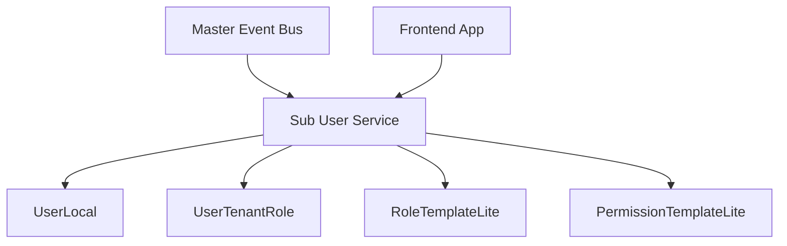

# 📘 Thiết kế chi tiết `user-service/sub/`

## 🎯 Mục tiêu

- Phục vụ các ứng dụng frontend tenant-based: dashboard giáo viên, phụ huynh, học sinh, quản trị tenant
- Không thực hiện ghi dữ liệu người dùng – toàn bộ dữ liệu được **consume từ Master**
- Đảm bảo khả năng đọc nhanh, chính xác quyền của người dùng trong context tenant
- Tách biệt hoàn toàn với dữ liệu tenant khác, phục vụ mô hình multi-tenant isolation

---

## 🧩 Thành phần chính

| Thành phần               | Vai trò chính                                                                 |
|--------------------------|-------------------------------------------------------------------------------|
| `UserLocal`              | Bản sao readonly của người dùng toàn cục (`UserGlobal`)                      |
| `UserTenantRole`         | Lưu gán vai trò của từng user trong tenant                                   |
| `RBACResolver`           | Tính toán danh sách permission của user dựa trên role_code và template cache |
| `RoleTemplateLite`       | Danh sách role template đồng bộ từ master (qua event)                         |
| `PermissionTemplateLite` | Danh sách permission template đồng bộ từ master                               |

---

## 🔄 Luồng đồng bộ dữ liệu (Cập nhật)

| Sự kiện                      | Hành động tại Sub User Service                                                                 |
|-----------------------------|-----------------------------------------------------------------------------------------------|
| `user_global_created`       | Tạo bản ghi `UserLocal`                                                                      |
| `user_updated`              | Cập nhật thông tin `UserLocal`                                                               |
| `user_assigned_to_tenant`   | Tạo hoặc cập nhật `UserLocal`, gán vai trò vào `UserTenantRole`, set `is_active_in_tenant = true` |
| `user_removed_from_tenant`  | Cập nhật `is_active_in_tenant = false` trong `UserLocal`                                      |
| `purge_user_from_tenant` (tuỳ chọn) | Xoá vật lý `UserLocal` nếu được định nghĩa rõ ràng trong chính sách dữ liệu       |
| `rbac_template_updated`     | Cập nhật các bản ghi `RoleTemplateLite`, `PermissionTemplateLite`                           |

> 📌 Theo ADR-026 và ADR-024, hành động `DELETE` cứng đối với `UserLocal` **chỉ thực hiện nếu nhận sự kiện purge rõ ràng từ master**.

---

## ⚙️ API behavior và logic nghiệp vụ

### `GET /users`
- Trả danh sách `UserLocal` đang active trong tenant
- Có filter theo `search`, `status`, phân trang
- Có thể cần `x-required-permission: tenant.read_users`

### `GET /users/me`
- Trả thông tin user hiện tại từ `UserLocal`
- Không yêu cầu permission (auth bằng token đã đủ)

### `GET /users/me/permissions`
- Gọi `RBACResolver` để:
  - lấy role của user trong tenant
  - expand thành danh sách permission (từ local cache)
- Có thể cache trong JWT hoặc Redis trong 5-15 phút để tăng tốc

### `GET /roles` & `GET /permissions`
- Trả dữ liệu từ bảng local `RoleTemplateLite` và `PermissionTemplateLite`
- Không gọi sang master (phù hợp event-driven, đảm bảo độc lập)

---

## 📐 Biểu đồ kiến trúc đơn giản

---

## ✅ ADR và tiêu chuẩn tuân thủ

| ADR     | Mức độ tuân thủ | Ghi chú                                                   |
| ------- | --------------- | --------------------------------------------------------- |
| ADR-012 | ✅ 100%          | Response chuẩn hoá với `meta`, `data`, `error`            |
| ADR-017 | ✅ Tốt           | Giới hạn dữ liệu trong tenant, không truy cập global      |
| ADR-025 | ✅ Tốt           | Version hoá schema qua event + template lite              |
| ADR-027 | ✅ Phù hợp       | Dữ liệu đồng bộ là metadata, không thao tác PII trực tiếp |

---

## 🔒 Bảo mật & phân quyền

* Auth bằng JWT token cấp tenant
* `x-required-permission` có thể được gắn vào `/users`, `/roles`, nhưng không cần cho `/me`
* Không có endpoint ghi – giảm thiểu rủi ro mất dữ liệu hoặc tấn công

---

## 📌 Ghi chú mở rộng

* Nếu muốn scale lớn: có thể thêm Redis cache cho permission
* RBACResolver có thể dùng decorator để wrap các API gọi tới business logic
